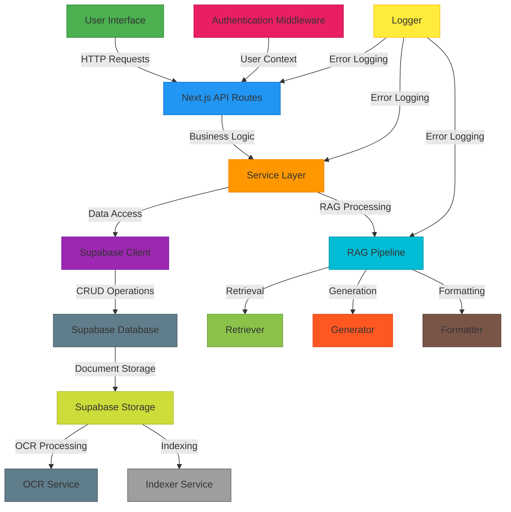

# NexiaMind AI Architecture Diagram

## Layered Architecture Overview

1. **Presentation Layer**: Next.js UI components and API routes
2. **Application Layer**: Business logic and service orchestration
3. **Domain Layer**: Core business rules and entities
4. **Infrastructure Layer**: External services (Supabase, RAG components)

## Data Flow

1. User interacts with UI → Next.js API routes
2. API routes validate auth → call service layer
3. Service layer orchestrates business logic → calls Supabase or RAG pipeline
4. RAG pipeline processes documents → generates responses
5. Responses returned through the same chain with proper formatting

## Key Integration Points

- **Authentication**: Middleware injects user context into all requests
- **RAG Pipeline**: Composable components for retrieval, generation, formatting
- **Data Access**: Centralized Supabase client with service layer abstraction
- **Error Handling**: Centralized logging across all layers