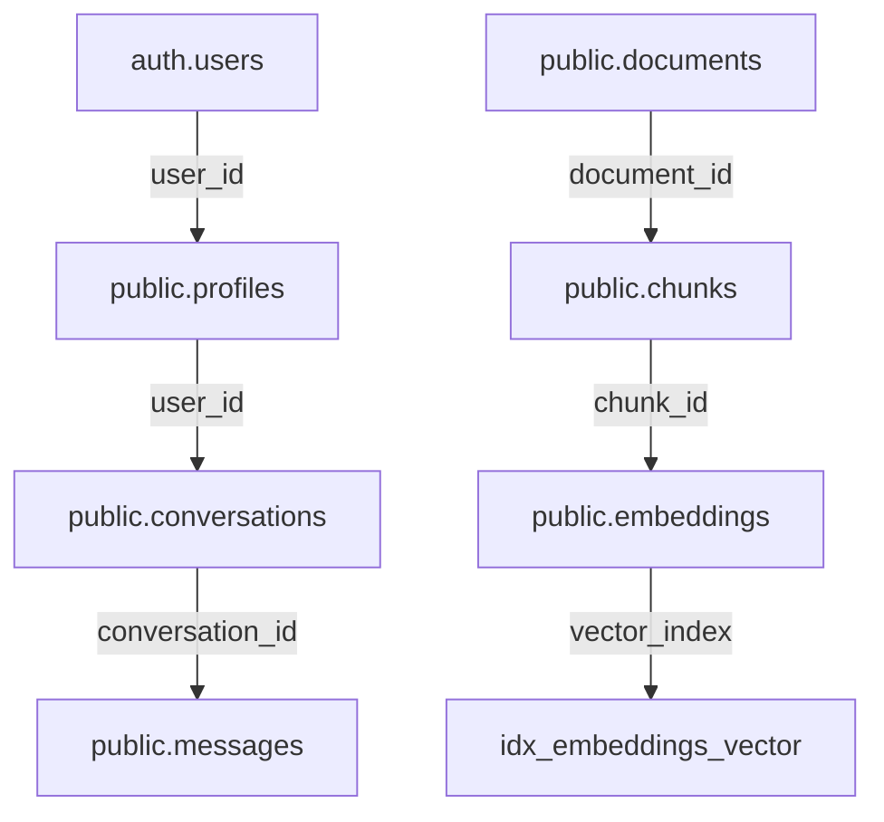

# Mise à Jour de la Structure de Base de Données - NexiaMind AI

**Date**: 2026-07-01
**Architecte**: Winston (bmad-agent-architect)
**Statut**: Complété

## Sommaire

Ce document documente la mise à jour de la documentation de la structure de base de données pour refléter la structure réelle implémentée dans Supabase, ainsi que les corrections apportées au code pour aligner avec cette structure.

## Problèmes Identifiés

1. **Documentation obsolète**: Les fichiers `bdd.md` et `architecture.md` contenaient une structure de base de données qui ne correspondait pas à la structure réelle.

2. **Incohérences dans le code**: Le code d'indexation essayait d'insérer des champs qui n'existent pas dans la table `embeddings`.

3. **Dimension des embeddings**: La documentation mentionnait `vector(1536)` alors que la base de données réelle utilise `vector(384)`.

## Corrections Apportées

### 1. Mise à Jour de la Documentation

#### Fichier: `_bmad-output/planning-artifacts/architecture-nexiamind-ai/bdd.md`

**Changements principaux:**
- Correction de la dimension des embeddings: `vector(384)` au lieu de `vector(1536)`
- Ajout de commentaires indiquant que cette structure représente la base de données réelle
- Correction des contraintes de clés étrangères pour utiliser la syntaxe complète
- Ajout d'une section "Notes sur la Structure Réelle" expliquant les différences
- Ajout d'un diagramme Mermaid montrant les relations entre les tables
- Ajout de recommandations pour les requêtes

#### Fichier: `_bmad-output/planning-artifacts/architecture-nexiamind-ai/architecture.md`

**Changements principaux:**
- Mise à jour de la section "Base de Données" pour refléter la structure réelle
- Correction de la dimension des embeddings
- Suppression de la mention du schema `rag` optionnel (toutes les tables sont dans `public`)
- Ajout de notes sur les différences clés
- Ajout d'un diagramme Mermaid des relations

### 2. Corrections du Code

#### Fichier: `src/lib/supabase/storage/indexer.ts`

**Problème:** Le code essayait d'insérer des champs inexistants dans la table `embeddings`:
```typescript
// Ancien code (incorrect)
.insert({
  chunk_id: savedChunk?.id,
  embedding: embedding.embedding,      // Champ incorrect
  dimensions: embedding.embedding.length,  // Champ inexistant
  model: 'mistral-embed',              // Champ inexistant
  token_count: embedding.tokenCount,   // Champ inexistant
});
```

**Correction:**
```typescript
// Nouveau code (correct)
.insert({
  chunk_id: savedChunk?.id,
  vector: embedding.embedding,  // Champ correct
});
```

## Structure de Base de Données Réelle

### Tables et Relations



### Différences Clés par Rapport à la Documentation Précédente

| Élément | Documentation Précédente | Structure Réelle |
|---------|------------------------|------------------|
| Dimension des embeddings | `vector(1536)` | `vector(384)` |
| Schema | `public` ou `rag` | `public` uniquement |
| Champ d'embedding | `embedding` | `vector` |
| Champs supplémentaires | `dimensions`, `model`, `token_count` | Non présents |

### Structure Complète des Tables

#### public.profiles
```sql
CREATE TABLE public.profiles (
    id uuid NOT NULL DEFAULT gen_random_uuid(),
    user_id uuid NOT NULL,
    email text NOT NULL,
    full_name text,
    role text NOT NULL DEFAULT 'developer'::text,
    avatar_url text,
    preferences jsonb DEFAULT '{}'::jsonb,
    created_at timestamp with time zone DEFAULT now(),
    updated_at timestamp with time zone DEFAULT now(),
    CONSTRAINT profiles_pkey PRIMARY KEY (id),
    CONSTRAINT profiles_user_id_fkey FOREIGN KEY (user_id) REFERENCES auth.users(id)
);
```

#### public.documents
```sql
CREATE TABLE public.documents (
    id uuid NOT NULL DEFAULT gen_random_uuid(),
    name text NOT NULL,
    type text NOT NULL,
    source text NOT NULL,
    client_id text,
    file_path text,
    file_size bigint,
    language text,
    mime_type text,
    checksum text,
    processed_at timestamp with time zone,
    created_at timestamp with time zone DEFAULT now(),
    updated_at timestamp with time zone DEFAULT now(),
    CONSTRAINT documents_pkey PRIMARY KEY (id)
);
```

#### public.chunks
```sql
CREATE TABLE public.chunks (
    id uuid NOT NULL DEFAULT gen_random_uuid(),
    document_id uuid NOT NULL,
    content text NOT NULL,
    chunk_index integer NOT NULL,
    token_count integer NOT NULL,
    hash text,
    metadata jsonb NOT NULL DEFAULT '{}'::jsonb,
    created_at timestamp with time zone DEFAULT now(),
    CONSTRAINT chunks_pkey PRIMARY KEY (id),
    CONSTRAINT chunks_document_id_fkey FOREIGN KEY (document_id) REFERENCES public.documents(id)
);
```

#### public.embeddings (Corrigé)
```sql
CREATE TABLE public.embeddings (
    id uuid NOT NULL DEFAULT gen_random_uuid(),
    chunk_id uuid NOT NULL,
    vector vector(384) NOT NULL,  -- Dimension réelle
    created_at timestamp with time zone DEFAULT now(),
    CONSTRAINT embeddings_pkey PRIMARY KEY (id),
    CONSTRAINT embeddings_chunk_id_fkey FOREIGN KEY (chunk_id) REFERENCES public.chunks(id)
);
```

## Impact sur le Code Existante

### Code qui Fonctionne Correctement (Aucune Modification Nécessaire)

1. **Retrieval Service** (`src/lib/rag/retriever.ts`):
   - Utilise déjà la bonne structure: `.from('embeddings').select('chunks(*)')`
   - La requête pgvector fonctionne correctement avec la dimension réelle

2. **API Routes**:
   - Toutes les routes API utilisent le service layer qui est correct

3. **Tests**:
   - Les tests utilisent des mocks et ne sont pas affectés par la structure réelle

### Code Corrigé

1. **Storage Indexer** (`src/lib/supabase/storage/indexer.ts`):
   - Corrigé pour utiliser le bon nom de champ `vector` au lieu de `embedding`
   - Suppression des champs inexistants (`dimensions`, `model`, `token_count`)

## Vérification et Validation

### Requêtes de Test Recommandées

1. **Vérification de la structure des tables:**
```sql
SELECT column_name, data_type 
FROM information_schema.columns 
WHERE table_name = 'embeddings';
```

2. **Test de recherche vectorielle:**
```sql
SELECT chunks(*), similarity 
FROM embeddings 
ORDER BY vector <=> '[0.1, 0.2, ..., 0.384]' 
LIMIT 5;
```

3. **Vérification des contraintes:**
```sql
SELECT constraint_name, constraint_type 
FROM information_schema.table_constraints 
WHERE table_name = 'embeddings';
```

## Recommandations pour le Développement Futur

1. **Génération de Documentation Automatique**:
   - Utiliser des outils comme `pg_dump` ou `supabase db diff` pour générer automatiquement la documentation de la structure

2. **Tests d'Intégration**:
   - Ajouter des tests qui vérifient la structure réelle de la base de données
   - Utiliser des migrations de base de données pour maintenir la synchronisation

3. **Gestion des Schémas**:
   - Envisager d'utiliser un outil de migration comme Flyway ou Liquibase
   - Documenter toutes les modifications de schéma dans un journal des changements

4. **Validation des Données**:
   - Ajouter des validations dans le code pour s'assurer que les embeddings ont la bonne dimension (384)

## Conclusion

La documentation a été mise à jour pour refléter la structure réelle de la base de données, et le code a été corrigé pour fonctionner avec cette structure. Les principales différences concernaient la dimension des embeddings et certains noms de champs. Le système devrait maintenant fonctionner correctement avec la base de données réelle.

**Fichiers Modifiés:**
- `_bmad-output/planning-artifacts/architecture-nexiamind-ai/bdd.md` ✅
- `_bmad-output/planning-artifacts/architecture-nexiamind-ai/architecture.md` ✅
- `src/lib/supabase/storage/indexer.ts` ✅

**Statut**: Toutes les corrections ont été appliquées et la documentation est maintenant synchronisée avec la structure réelle de la base de données.