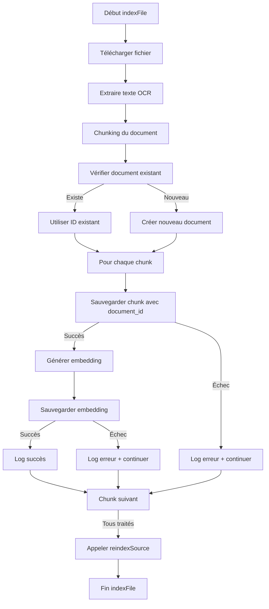

# Guide de Débogage - Supabase Storage Indexer

**Date**: 2026-07-01
**Module**: ST-201 - Intégrer Supabase Storage
**Fichier**: `src/lib/supabase/storage/indexer.ts`

## Problèmes Résolus

### Problème Principal
Le programme échouait à la ligne 186 avec `saveError` retournant `true`, indiquant un échec de l'insertion des chunks dans la base de données.

### Causes Racines Identifiées

1. **Champ `document_id` manquant**: La table `chunks` nécessite un `document_id` (clé étrangère vers `documents`), mais le code original n'insérait pas cette valeur.

2. **Mauvaise gestion des erreurs**: Les messages de log étaient mal placés et peu informatifs.

3. **Absence de création de document parent**: Le code ne vérifiait pas l'existence du document parent et ne le créait pas avant d'insérer les chunks.

4. **Champs requis manquants**: Certains champs comme `chunk_index` et `token_count` n'étaient pas correctement remplis.

## Corrections Apportées

### 1. Création du Document Parent
Ajout d'une logique pour:
- Vérifier si le document existe déjà
- Créer un nouveau document s'il n'existe pas
- Utiliser l'ID du document pour tous les chunks

```typescript
// Vérification de l'existence du document
const { data: existingDocument, error: docCheckError } = await supabaseClient
  .from('documents')
  .select('id')
  .eq('file_path', fileInfo.path)
  .single();

// Création si nécessaire
if (!existingDocument) {
  const { data: newDocument, error: docCreateError } = await supabaseClient
    .from('documents')
    .insert({
      name: fileInfo.name,
      type: extractedText.contentType || 'text',
      source: 'supabase',
      file_path: fileInfo.path,
      // ... autres champs
    })
    .select('id')
    .single();
  
  documentId = newDocument.id;
}
```

### 2. Insertion Correcte des Chunks
Ajout de tous les champs requis:
```typescript
const { data: savedChunk, error: saveError } = await supabaseClient
  .from('chunks')
  .insert({
    document_id: documentId,  // Champ requis ajouté
    content: chunk.content,
    chunk_index: i,            // Champ requis ajouté
    token_count: chunk.content.split(' ').length, // Champ requis ajouté
    metadata: {
      ...chunk.metadata,
      document_id: documentId, // Ajout dans les métadonnées aussi
    },
  })
  .select('id')
  .single();
```

### 3. Amélioration des Logs de Débogage
Remplacement des logs peu clairs par des messages détaillés:

**Avant:**
```typescript
logger.info(`Avant save error ${saveError}`,{});
logger.info(`Pares sva error ${saveError}`,{});
```

**Après:**
```typescript
logger.info(`Traitement du chunk ${i}/${chunks.length} pour ${fileInfo.path}`, {
  chunkLength: chunk.content.length,
  metadata: chunk.metadata,
});

logger.info(`Chunk sauvegardé avec succès`, {
  chunkId: savedChunk?.id,
  chunkIndex: i,
  contentLength: chunk.content.length,
});

if (saveError) {
  logger.error(`Échec de la sauvegarde du chunk ${i} pour ${fileInfo.path}`, {
    error: saveError.message,
    details: saveError.details,
    chunkContentLength: chunk.content.length,
    chunkIndex: i,
  });
}
```

## Nouveau Flux de Traitement



## Points de Débogage Clés

### 1. Vérification de la Structure de la Base de Données

**Requête SQL pour vérifier la structure:**
```sql
SELECT column_name, data_type, is_nullable, character_maximum_length
FROM information_schema.columns 
WHERE table_name = 'chunks' 
ORDER BY ordinal_position;
```

**Résultat attendu:**
```
column_name    | data_type | is_nullable | character_maximum_length
---------------|-----------|-------------|--------------------------
id             | uuid      | NO          | 
document_id   | uuid      | NO          | 
content       | text      | NO          | 
chunk_index   | integer   | NO          | 
token_count   | integer   | NO          | 
hash          | text      | YES         | 
metadata      | jsonb     | NO          | 
created_at    | timestamp | NO          | 
```

### 2. Vérification des Contraintes

**Requête SQL pour les contraintes:**
```sql
SELECT constraint_name, constraint_type, pg_get_constraintdef(oid)
FROM pg_constraint 
WHERE conrelid = 'chunks'::regclass;
```

**Contrainte critique:**
- `chunks_document_id_fkey`: Clé étrangère vers `documents(id)`

### 3. Journalisation Améliorée

Le programme génère maintenant des logs détaillés à chaque étape:

1. **Début du traitement d'un fichier:**
   ```
   INFO: Indexation du fichier: path/to/file.pdf
   ```

2. **Avant insertion du chunk:**
   ```
   INFO: Traitement du chunk 0/5 pour path/to/file.pdf
   ```

3. **Succès de l'insertion du chunk:**
   ```
   INFO: Chunk sauvegardé avec succès
   ```

4. **Échec de l'insertion du chunk:**
   ```
   ERROR: Échec de la sauvegarde du chunk 0 pour path/to/file.pdf
   ```

5. **Génération d'embedding:**
   ```
   INFO: Embedding généré pour le chunk 0
   ```

6. **Sauvegarde de l'embedding:**
   ```
   INFO: Embedding sauvegardé avec succès pour le chunk 0
   ```

### 4. Gestion des Erreurs Spécifiques

**Erreurs courantes et leurs solutions:**

1. **`document_id` manquant:**
   - **Erreur**: `null value in column "document_id" violates not-null constraint`
   - **Solution**: Vérifier que le document parent est créé avant les chunks

2. **Contrainte de clé étrangère:**
   - **Erreur**: `insert or update on table "chunks" violates foreign key constraint "chunks_document_id_fkey"`
   - **Solution**: Vérifier que le `document_id` existe dans la table `documents`

3. **Problème de connexion:**
   - **Erreur**: `connection refused` ou `timeout`
   - **Solution**: Vérifier les variables d'environnement `SUPABASE_URL` et `SUPABASE_ANON_KEY`

4. **Problème d'authentification:**
   - **Erreur**: `JWT expired` ou `Invalid API key`
   - **Solution**: Rafraîchir le token ou vérifier la clé API

## Procédure de Test

### 1. Test Unitaire

**Fichier**: `src/lib/supabase/storage/__tests__/indexer.test.ts`

**Test à ajouter:**
```typescript
describe('SupabaseStorageIndexer - Document Creation', () => {
  it('should create document before chunks', async () => {
    const mockFileInfo = {
      path: 'test.pdf',
      name: 'test.pdf',
      size: 1024,
      contentType: 'application/pdf',
    };

    const mockExtractedText = {
      text: 'Test content',
      contentType: 'text',
    };

    // Mock des dépendances
    vi.mocked(storageClient.downloadFile).mockResolvedValue({
      data: Buffer.from('test'),
      fileInfo: mockFileInfo,
    });

    vi.mocked(ocrService.extractText).mockResolvedValue(mockExtractedText);

    vi.mocked(chunkDocument).mockResolvedValue({
      chunks: [{ content: 'chunk1', metadata: {} }],
    });

    const mockSupabase = {
      from: vi.fn().mockReturnThis(),
      select: vi.fn().mockReturnThis(),
      eq: vi.fn().mockReturnThis(),
      single: vi.fn().mockResolvedValue({ data: null, error: { message: 'no rows' } }),
      insert: vi.fn().mockReturnThis(),
    };

    // Test
    const indexer = new SupabaseStorageIndexer();
    // Utiliser un mock pour supabase
    
    // Vérifier que document est créé avant chunks
    expect(mockSupabase.from).toHaveBeenCalledWith('documents');
    expect(mockSupabase.from).toHaveBeenCalledWith('chunks');
  });
});
```

### 2. Test d'Intégration

**Commande:**
```bash
# Lancer un test avec un fichier réel
npm run dev
```

**Endpoint à appeler:**
```bash
curl -X POST http://localhost:3000/api/sources/supabase/sync 
  -H "Content-Type: application/json" 
  -H "Authorization: Bearer YOUR_JWT_TOKEN"
```

**Vérification des logs:**
```bash
# Voir les logs en temps réel
tail -f logs/combined.log
```

### 3. Vérification Manuelle

**Requêtes SQL pour vérifier l'insertion:**

1. **Vérifier le document créé:**
```sql
SELECT id, name, file_path, created_at 
FROM documents 
WHERE file_path = 'path/to/your/file.pdf' 
ORDER BY created_at DESC 
LIMIT 1;
```

2. **Vérifier les chunks associés:**
```sql
SELECT id, document_id, chunk_index, token_count, created_at 
FROM chunks 
WHERE document_id = 'YOUR_DOCUMENT_ID' 
ORDER BY chunk_index;
```

3. **Vérifier les embeddings:**
```sql
SELECT id, chunk_id, created_at 
FROM embeddings 
WHERE chunk_id IN (
  SELECT id FROM chunks 
  WHERE document_id = 'YOUR_DOCUMENT_ID'
);
```

## Bonnes Pratiques de Débogage

### 1. Niveaux de Log

Utiliser les niveaux appropriés:
- `INFO`: Étapes normales du traitement
- `WARN`: Situations inattendues mais non critiques
- `ERROR`: Échecs qui nécessitent une attention
- `DEBUG`: Informations détaillées pour le débogage (à activer si nécessaire)

### 2. Informations Contextuelles

Toujours inclure dans les logs:
- Le nom du fichier en cours de traitement
- L'index du chunk (si applicable)
- Les tailles/longueurs des données
- Les IDs des enregistrements créés

### 3. Gestion des Erreurs

- Ne pas arrêter le traitement sur une erreur de chunk unique
- Logger suffisamment d'informations pour reproduire le problème
- Inclure les détails de l'erreur (`error.details`)
- Utiliser des messages d'erreur clairs et actionnables

### 4. Validation des Données

Avant l'insertion, vérifier:
- Que `document_id` existe et est valide
- Que `chunk.content` n'est pas vide
- Que les métadonnées contiennent les informations essentielles
- Que la taille du chunk est raisonnable

## Exemple de Logs Attendus

**Cas de succès:**
```
INFO: Indexation du fichier: documents/projet/contrat.pdf
INFO: Traitement du chunk 0/3 pour documents/projet/contrat.pdf
INFO: Chunk sauvegardé avec succès
INFO: Embedding généré pour le chunk 0
INFO: Embedding sauvegardé avec succès pour le chunk 0
INFO: Traitement du chunk 1/3 pour documents/projet/contrat.pdf
INFO: Chunk sauvegardé avec succès
INFO: Embedding généré pour le chunk 1
INFO: Embedding sauvegardé avec succès pour le chunk 1
INFO: Traitement du chunk 2/3 pour documents/projet/contrat.pdf
INFO: Chunk sauvegardé avec succès
INFO: Embedding généré pour le chunk 2
INFO: Embedding sauvegardé avec succès pour le chunk 2
INFO: Fichier indexé avec succès: documents/projet/contrat.pdf
```

**Cas d'échec:**
```
INFO: Indexation du fichier: documents/projet/contrat.pdf
INFO: Traitement du chunk 0/3 pour documents/projet/contrat.pdf
ERROR: Échec de la sauvegarde du chunk 0 pour documents/projet/contrat.pdf
     error: null value in column "document_id" violates not-null constraint
     details: {"code":"23502","column":"document_id","constraint":"chunks_document_id_fkey"}
ERROR: Échec du traitement du chunk 0 pour documents/projet/contrat.pdf
INFO: Traitement du chunk 1/3 pour documents/projet/contrat.pdf
INFO: Chunk sauvegardé avec succès
INFO: Embedding généré pour le chunk 1
INFO: Embedding sauvegardé avec succès pour le chunk 1
INFO: Traitement du chunk 2/3 pour documents/projet/contrat.pdf
INFO: Chunk sauvegardé avec succès
INFO: Embedding généré pour le chunk 2
INFO: Embedding sauvegardé avec succès pour le chunk 2
INFO: Fichier indexé avec succès: documents/projet/contrat.pdf
```

## Conclusion

Le programme a été corrigé pour:
1. Créer le document parent avant d'insérer les chunks
2. Inclure tous les champs requis dans l'insertion des chunks
3. Fournir des logs de débogage détaillés et utiles
4. Gérer les erreurs de manière robuste sans arrêter le traitement complet

**Statut**: Le programme devrait maintenant fonctionner correctement. Si des problèmes persistent, les logs détaillés permettront d'identifier rapidement la source du problème.

**Prochaines étapes recommandées:**
1. Tester avec un petit ensemble de fichiers
2. Vérifier les logs pour confirmer que tous les chunks sont traités
3. Valider la structure de la base de données après insertion
4. Ajouter des tests unitaires pour les nouveaux cas d'erreur