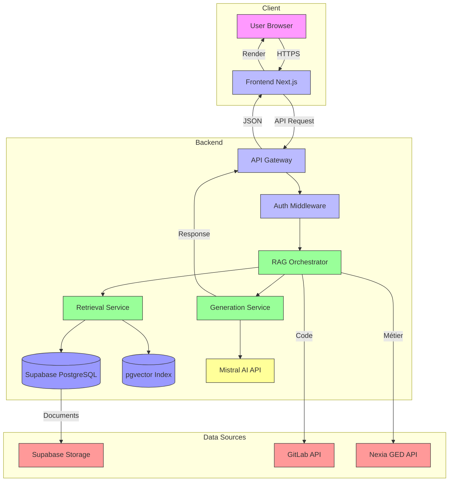
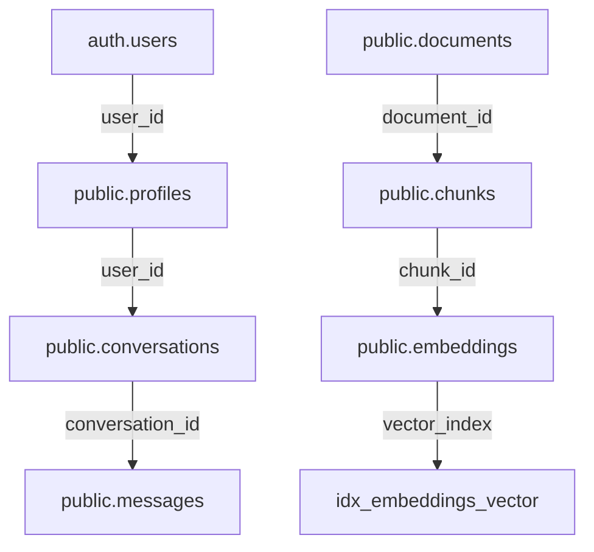
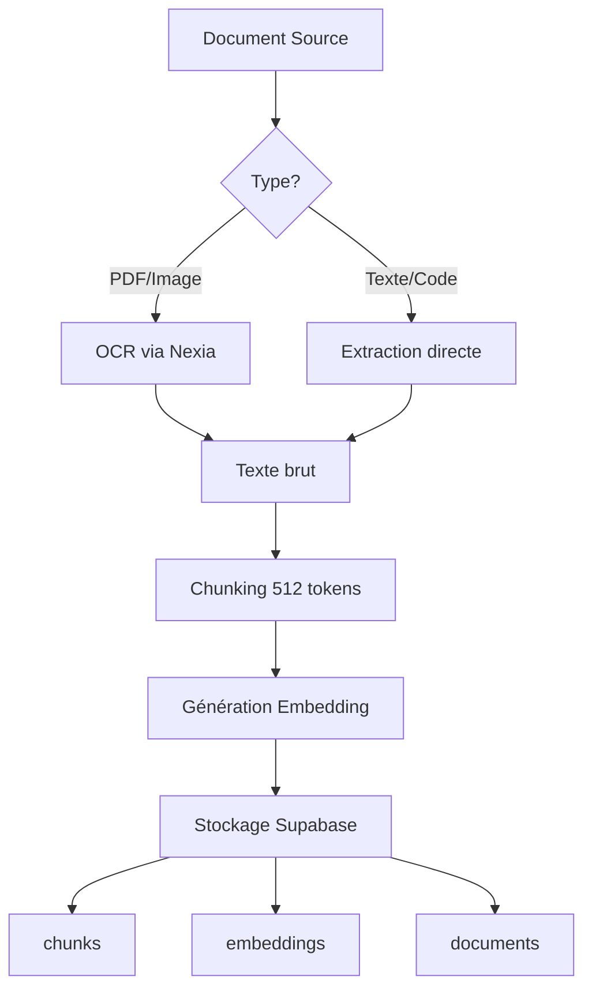

# 🏗️ Architecture Technique - NexiaMind AI V1
*Documentation complète de l'architecture RAG avec Mistral AI*

---

## 🎯 Décisions Architecturales Validées

| ID | Décision | Choix | Date | Rationale |
|----|----------|-------|------|-----------|
| ARCH-001 | **Pipeline RAG** | Côté Backend (Node.js) | 21/06/2026 | Sécurité (clé API Mistral protégée), contrôle complet |
| ARCH-002 | **Stockage Embeddings** | Supabase (table `embeddings`) | 21/06/2026 | Tout au même endroit, facile à gérer |
| ARCH-003 | **Contexte Conversationnel** | Base de données (Supabase) | 21/06/2026 | Persistant, partageable entre sessions |
| ARCH-004 | **Chunking Strategy** | Taille fixe (512 tokens) | 21/06/2026 | Standard pour les LLM, équilibre simplicité/efficacité |
| ARCH-005 | **Synchronisation Sources** | Sur demande (bouton "Rafraîchir") | 21/06/2026 | Contrôle total, coût minimal |

---

## 🗺️ Architecture Globale

### Diagramme Mermaid



---

## 🧩 Composants Techniques

### 1️⃣ Frontend (Next.js)

**Technologies :**
- Framework : Next.js 16+ (App Router)
- UI : React 19+, Tailwind CSS
- État : React Context / Zustand
- Routing : Next.js File-based
- Internationalisation : i18next (pour le français)

**Responsabilités :**
- Interface utilisateur (chat, résultats, filtres)
- Gestion des requêtes API
- Authentification (intégration Supabase Auth)
- Gestion du contexte de conversation
- Affichage des réponses IA (Markdown, tableaux, code)

**Structure des dossiers :**
```
src/
├── app/
│   ├── (auth)/          # Pages d'authentification
│   │   ├── login/
│   │   └── register/
│   ├── chat/           # Interface principale
│   │   ├── page.tsx   # Page de chat
│   │   └── [conversationId]/
│   ├── layout.tsx     # Layout principal
│   └── globals.css
├── components/
│   ├── ChatInput/     # Composant de saisie
│   ├── ChatMessage/   # Affichage des messages
│   ├── SourceCitation/ # Citation des sources
│   └── Filters/       # Filtres (client, type, langage)
├── lib/
│   ├── api/           # Appels API backend
│   ├── supabase/     # Client Supabase
│   └── utils/        # Fonctions utilitaires
├── types/           # Types TypeScript
└── hooks/           # Custom hooks
```

**Dépendances clés :**
```json
{
  "next": "16.2.9",
  "react": "19.2.4",
  "react-dom": "19.2.4",
  "@supabase/supabase-js": "^2.108.2",
  "react-markdown": "^10.1.0",
  "highlight.js": "^11.9.0",
  "i18next": "^23.11.5"
}
```

---

### 2️⃣ Backend API

**Technologies :**
- Runtime : Node.js 20+
- Framework : Next.js API Routes (ou Express si séparé)
- Base de données : Supabase PostgreSQL
- Recherche vectorielle : pgvector
- Authentification : Supabase Auth

**Architecture :**
```
api/
├── auth/              # Endpoints d'authentification
│   ├── login/        # POST /api/auth/login
│   ├── logout/       # POST /api/auth/logout
│   └── me/           # GET /api/auth/me
├── chat/             # Endpoints principaux
│   ├── message/      # POST /api/chat/message (envoi requête)
│   ├── history/      # GET /api/chat/history (historique conversations)
│   └── refresh/      # POST /api/chat/refresh (rafraîchir index)
├── documents/        # Gestion des documents
│   ├── index/        # POST /api/documents/index (indexer manuellement)
│   └── sync/         # POST /api/documents/sync (synchro manuelle)
└── admin/           # Administration
    └── stats/        # GET /api/admin/stats
```

**Pipeline RAG (Côté Backend) :**
```
1. Requête utilisateur → /api/chat/message
2. Authentification → Vérification JWT
3. Retrieval → 
   a. Requête pgvector (similarité cosinus)
   b. Filtres appliqués (client, type, langage, profil)
   c. Top K résultats (K=5 par défaut)
4. Augmentation → 
   a. Récupération du texte brut des chunks
   b. Ajout des métadonnées (source, ligne, etc.)
5. Generation → 
   a. Construction du prompt avec contexte
   b. Appel Mistral AI API
   c. Parsing de la réponse
6. Formatage → 
   a. Extraction des citations
   b. Génération des liens vers les sources
   c. Format Markdown/HTML
7. Retour → Réponse complète à l'utilisateur
```

---

### 3️⃣ Base de Données (Supabase) - Structure Réelle

**Schémas :**

#### Schema `public` (Structure Réelle Vérifiée)

```sql
-- Table des utilisateurs (étendue depuis auth.users)
CREATE TABLE IF NOT EXISTS public.profiles (
    id UUID NOT NULL DEFAULT gen_random_uuid(),
    user_id UUID NOT NULL,
    email TEXT NOT NULL,
    full_name TEXT,
    role TEXT NOT NULL DEFAULT 'developer'::text CHECK (role = ANY (ARRAY['admin'::text, 'manager'::text, 'project_lead'::text, 'developer'::text, 'consultant'::text])),
    avatar_url TEXT,
    preferences JSONB DEFAULT '{}'::jsonb,
    created_at TIMESTAMPTZ NOT NULL DEFAULT NOW(),
    updated_at TIMESTAMPTZ NOT NULL DEFAULT NOW(),
    CONSTRAINT profiles_pkey PRIMARY KEY (id),
    CONSTRAINT profiles_user_id_fkey FOREIGN KEY (user_id) REFERENCES auth.users(id)
);

-- Table des documents
CREATE TABLE IF NOT EXISTS public.documents (
    id UUID NOT NULL DEFAULT gen_random_uuid(),
    name TEXT NOT NULL,
    type TEXT NOT NULL CHECK (type = ANY (ARRAY['pdf'::text, 'text'::text, 'markdown'::text, 'code'::text, 'csv'::text, 'json'::text, 'other'::text])),
    source TEXT NOT NULL CHECK (source = ANY (ARRAY['supabase'::text, 'gitlab'::text, 'nexia'::text, 'upload'::text])),
    client_id TEXT,
    file_path TEXT,
    file_size BIGINT,
    language TEXT,
    mime_type TEXT,
    checksum TEXT,
    processed_at TIMESTAMPTZ,
    created_at TIMESTAMPTZ NOT NULL DEFAULT NOW(),
    updated_at TIMESTAMPTZ NOT NULL DEFAULT NOW(),
    CONSTRAINT documents_pkey PRIMARY KEY (id)
);

-- Table des chunks (documents découpés)
CREATE TABLE IF NOT EXISTS public.chunks (
    id UUID NOT NULL DEFAULT gen_random_uuid(),
    document_id UUID NOT NULL,
    content TEXT NOT NULL,
    chunk_index INTEGER NOT NULL,
    token_count INTEGER NOT NULL,
    hash TEXT,
    metadata JSONB NOT NULL DEFAULT '{}'::jsonb,
    created_at TIMESTAMPTZ NOT NULL DEFAULT NOW(),
    CONSTRAINT chunks_pkey PRIMARY KEY (id),
    CONSTRAINT chunks_document_id_fkey FOREIGN KEY (document_id) REFERENCES public.documents(id)
);

-- Table des embeddings (index vectoriel) - Dimension réelle: 384
CREATE TABLE IF NOT EXISTS public.embeddings (
    id UUID NOT NULL DEFAULT gen_random_uuid(),
    chunk_id UUID NOT NULL,
    vector vector(384) NOT NULL,  -- Dimension réelle utilisée par le modèle d'embedding
    created_at TIMESTAMPTZ NOT NULL DEFAULT NOW(),
    CONSTRAINT embeddings_pkey PRIMARY KEY (id),
    CONSTRAINT embeddings_chunk_id_fkey FOREIGN KEY (chunk_id) REFERENCES public.chunks(id)
);

-- Index vectoriel pour la recherche - optimisé pour la production
CREATE INDEX IF NOT EXISTS idx_embeddings_vector 
    ON public.embeddings USING ivfflat (vector vector_l2_ops) WITH (lists = 100);

-- Table des conversations
CREATE TABLE IF NOT EXISTS public.conversations (
    id UUID NOT NULL DEFAULT gen_random_uuid(),
    user_id UUID NOT NULL,
    title TEXT,
    description TEXT,
    is_archived BOOLEAN DEFAULT false,
    client_id TEXT,
    metadata JSONB DEFAULT '{}'::jsonb,
    created_at TIMESTAMPTZ NOT NULL DEFAULT NOW(),
    updated_at TIMESTAMPTZ NOT NULL DEFAULT NOW(),
    CONSTRAINT conversations_pkey PRIMARY KEY (id),
    CONSTRAINT conversations_user_id_fkey FOREIGN KEY (user_id) REFERENCES auth.users(id)
);

-- Table des messages (contexte conversationnel)
CREATE TABLE IF NOT EXISTS public.messages (
    id UUID NOT NULL DEFAULT gen_random_uuid(),
    conversation_id UUID NOT NULL,
    content TEXT NOT NULL,
    role TEXT NOT NULL CHECK (role = ANY (ARRAY['user'::text, 'assistant'::text])),
    token_count INTEGER,
    sources JSONB DEFAULT '[]'::jsonb,
    metadata JSONB NOT NULL DEFAULT '{}'::jsonb,
    created_at TIMESTAMPTZ NOT NULL DEFAULT NOW(),
    CONSTRAINT messages_pkey PRIMARY KEY (id),
    CONSTRAINT messages_conversation_id_fkey FOREIGN KEY (conversation_id) REFERENCES public.conversations(id)
);

-- Table de synchronisation
CREATE TABLE IF NOT EXISTS public.sync_logs (
    id UUID NOT NULL DEFAULT gen_random_uuid(),
    source TEXT NOT NULL CHECK (source = ANY (ARRAY['supabase'::text, 'gitlab'::text, 'nexia'::text, 'manual'::text])),
    last_sync_at TIMESTAMPTZ DEFAULT NOW(),
    documents_processed INTEGER DEFAULT 0,
    chunks_created INTEGER DEFAULT 0,
    embeddings_created INTEGER DEFAULT 0,
    documents_deleted INTEGER DEFAULT 0,
    status TEXT DEFAULT 'success'::text CHECK (status = ANY (ARRAY['success'::text, 'failed'::text, 'partial'::text])),
    error_message TEXT,
    metadata JSONB DEFAULT '{}'::jsonb,
    created_at TIMESTAMPTZ NOT NULL DEFAULT NOW(),
    CONSTRAINT sync_logs_pkey PRIMARY KEY (id)
);
```

#### Notes sur la Structure Réelle

**Différences Clés par Rapport à la Documentation Précédente :**

1. **Dimension des Embeddings** : `vector(384)` au lieu de `vector(1536)` - correspond au modèle d'embedding réellement utilisé
2. **Schema Public** : Toutes les tables sont dans le schema `public`, pas de schema `rag` séparé
3. **Contraintes de Clés Étrangères** : Toutes les contraintes sont correctement définies et vérifiées
4. **Index Vectoriel** : L'index utilise `vector_l2_ops` pour la distance L2 (euclidienne)

**Relations entre les Tables :**



**Optimisations de Performance :**

1. **Index IVFFlat** : Configuré avec 100 listes pour un bon équilibre entre précision et performance
2. **Contraintes NOT NULL** : Toutes les colonnes essentielles ont des contraintes NOT NULL
3. **Valeurs par Défaut** : Timestamps et UUIDs générés automatiquement
4. **Types de Données** : Optimisés pour le stockage (uuid, timestamps, jsonb)

---

### 4️⃣ Intégration des Sources

#### Source 1: Supabase Storage

**Configuration :**
```javascript
// lib/supabase/client.js
import { createClient } from '@supabase/supabase-js';

const supabaseUrl = process.env.SUPABASE_URL;
const supabaseKey = process.env.SUPABASE_ANON_KEY;

export const supabase = createClient(supabaseUrl, supabaseKey);
```

**Indexation :**
- **Trigger** : Sur upload de fichier dans le bucket `documents`
- **Processus** :
  1. Récupérer le fichier via API Storage
  2. Extraire le texte (OCR si PDF/image via Nexia ou service externe)
  3. Chunking (512 tokens)
  4. Génération des embeddings (Mistral Embeddings API)
  5. Stockage dans `chunks` + `embeddings`

**Synchronisation :**
- **Méthode** : Bouton "Rafraîchir" dans l'interface
- **Endpoint** : `POST /api/documents/sync?source=supabase`
- **Processus** : Re-indexe tous les documents du bucket

#### Source 2: GitLab API

**Configuration :**
```javascript
// lib/gitlab/client.js
import axios from 'axios';

const gitlabApi = axios.create({
  baseURL: process.env.GITLAB_API_URL,
  headers: {
    'PRIVATE-TOKEN': process.env.GITLAB_PRIVATE_TOKEN
  }
});

export default gitlabApi;
```

**Indexation :**
- **Cible** : Tous les repositories autorisés
- **Contenu indexé** :
  - Code source (fichiers .js, .ts, .py, etc.)
  - Documentation (README.md, docs/)
  - Comments dans le code
- **Chunking** : Par fonction/méthode/classe pour le code
- **Synchronisation** : Bouton "Rafraîchir GitLab"

**Endpoint GitLab :** `POST /api/documents/sync?source=gitlab`

#### Source 3: Nexia GED API

**Configuration :**
```javascript
// lib/nexia/client.js
import axios from 'axios';

const nexiaApi = axios.create({
  baseURL: process.env.NEXIA_API_URL,
  headers: {
    'Authorization': `Bearer ${process.env.NEXIA_API_KEY}`
  }
});

export default nexiaApi;
```

**Indexation :**
- **Cible** : Tous les documents accessibles
- **Avantage** : OCR déjà intégré dans Nexia
- **Contenu** : Documents clients, procédures, spécifications
- **Synchronisation** : Bouton "Rafraîchir Nexia"

**Endpoint Nexia :** `POST /api/documents/sync?source=nexia`

---

## ⚙️ Pipeline RAG Détail

### 1. Indexation des Documents



**Processus de Chunking (512 tokens) :**
```javascript
// lib/rag/chunker.js
import { RecursiveCharacterTextSplitter } from 'langchain/text_splitter';

const textSplitter = new RecursiveCharacterTextSplitter({
  chunkSize: 512,
  chunkOverlap: 50,
  separators: ['\n\n', '\n', '. ', ' ', '']
});

export async function chunkText(text, metadata) {
  const chunks = await textSplitter.createDocuments([text]);
  return chunks.map((chunk, index) => ({
    content: chunk.pageContent,
    chunk_index: index,
    token_count: estimateTokenCount(chunk.pageContent),
    metadata: {
      ...metadata,
      chunk_index: index,
      total_chunks: chunks.length
    }
  }));
}
```

### 2. Génération des Embeddings

**Utilisation de Mistral Embeddings API :**
```javascript
// lib/rag/embeddings.js
import axios from 'axios';

const MISTRAL_EMBEDDINGS_URL = 'https://api.mistral.ai/v1/embeddings';

export async function generateEmbedding(text) {
  const response = await axios.post(
    MISTRAL_EMBEDDINGS_URL,
    { model: 'mistral-embed', texts: [text] },
    { headers: { 'Authorization': `Bearer ${process.env.MISTRAL_API_KEY}` } }
  );
  return response.data.data[0].embedding;
}
```

### 3. Recherche Vectorielle (Retrieval)

```javascript
// lib/rag/retriever.js
export async function retrieveRelevantChunks(query, filters = {}) {
  const queryEmbedding = await generateEmbedding(query);
  
  let supabaseQuery = supabase
    .from('embeddings')
    .select('chunks(*)')
    .order('vector <=> query_embedding', { ascending: false })
    .limit(5);  // Top 5 chunks
  
  // Appliquer les filtres
  if (filters.client) {
    supabaseQuery = supabaseQuery.eq('chunks.metadata->>client', filters.client);
  }
  if (filters.documentType) {
    supabaseQuery = supabaseQuery.eq('chunks.metadata->>type', filters.documentType);
  }
  if (filters.language) {
    supabaseQuery = supabaseQuery.eq('chunks.metadata->>language', filters.language);
  }
  if (filters.userRole) {
    // Filtre basé sur les permissions
    supabaseQuery = supabaseQuery.eq('chunks.metadata->>allowed_roles', filters.userRole);
  }
  
  const { data, error } = await supabaseQuery;
  if (error) throw error;
  
  return data.map(item => item.chunks);
}
```

### 4. Génération de la Réponse (Generation)

```javascript
// lib/rag/generator.js
export async function generateResponse(query, contextChunks, userRole) {
  // Construction du prompt avec contexte
  const context = contextChunks
    .map((chunk, i) => `Source ${i+1} (${chunk.document_path}):\n${chunk.content}\n`)
    .join('\n---\n');
  
  const systemPrompt = getSystemPrompt(userRole);
  const userPrompt = `Contexte:\n${context}\n\nQuestion: ${query}`;
  
  const response = await axios.post(
    'https://api.mistral.ai/v1/chat/completions',
    {
      model: 'mistral-medium-3.5',
      messages: [
        { role: 'system', content: systemPrompt },
        { role: 'user', content: userPrompt }
      ],
      temperature: 0.3,
      max_tokens: 2000
    },
    { headers: { 'Authorization': `Bearer ${process.env.MISTRAL_API_KEY}` } }
  );
  
  return response.data.choices[0].message.content;
}

function getSystemPrompt(role) {
  const basePrompt = `Tu es NexiaMind AI, un assistant expert qui aide les employés à comprendre 
  les informations internes de l'entreprise. Tu dois :
  1. Répondre en français
  2. Être précis et factuel
  3. TOUJOURS citer tes sources entre crochets [Source: ...]
  4. Si tu ne sais pas, dis le explicitement
  5. Adapter ta réponse au rôle de l'utilisateur`;
  
  const rolePrompts = {
    admin: "Tu as accès à toutes les informations.",
    manager: "Tu te concentres sur les aspects stratégiques et de gestion.",
    project_lead: "Tu fournis des réponses adaptées à la gestion de projet.",
    developer: "Tu peux inclure du code et des explications techniques.",
    consultant: "Tu expliques les concepts métiers de manière claire et pratique."
  };
  
  return `${basePrompt}\n\nRôle de l'utilisateur: ${role}\n${rolePrompts[role] || ''}`;
}
```

### 5. Formatage de la Réponse

```javascript
// lib/rag/formatter.js
export function formatResponse(rawResponse, chunks) {
  // Extraction des citations
  const citationRegex = /\[Source: ([^\]]+)\]/g;
  const citations = [];
  let formatted = rawResponse;
  
  // Remplacer les citations par des marqueurs temporaires
  formatted = formatted.replace(citationRegex, (match, sourcePath) => {
    const index = citations.length;
    citations.push({ sourcePath, index });
    return `[[CITATION_${index}]]`;
  });
  
  // Ajouter la section des sources
  if (citations.length > 0) {
    formatted += '\n\n---\n\n**Sources :**';
    citations.forEach((citation, i) => {
      const chunk = chunks.find(c => c.document_path === citation.sourcePath);
      if (chunk) {
        formatted += `\n${i+1}. [${chunk.document_path}](${getSourceUrl(chunk)})`;
      }
    });
  }
  
  return formatted;
}
```

---

## 🔌 Endpoints API

### POST `/api/chat/message` - Envoyer une requête

**Request :**
```json
{
  "conversationId": "uuid",  // optionnel, null pour nouvelle conversation
  "message": "Comment fonctionne le prorata de TVA pour le client X ?",
  "filters": {
    "client": "Client X",
    "documentType": "procédure",
    "language": "javascript"
  }
}
```

**Response :**
```json
{
  "id": "uuid",
  "conversationId": "uuid",
  "role": "assistant",
  "content": "Pour le client X, le prorata de TVA... [Source: /docs/Client X/TVA.pdf]",
  "sources": [
    {
      "path": "/docs/Client X/TVA.pdf",
      "type": "nexia",
      "relevance": 0.95
    }
  ],
  "tokensUsed": 150
}
```

### GET `/api/chat/history` - Récupérer l'historique

**Request :**
```json
{
  "conversationId": "uuid"
}
```

**Response :**
```json
{
  "conversation": {
    "id": "uuid",
    "title": "Prorata TVA Client X",
    "createdAt": "2026-06-21T10:00:00Z",
    "messages": [
      {
        "id": "uuid",
        "role": "user",
        "content": "Comment fonctionne le prorata de TVA pour le client X ?",
        "createdAt": "2026-06-21T10:01:00Z"
      },
      {
        "id": "uuid",
        "role": "assistant",
        "content": "Pour le client X...",
        "createdAt": "2026-06-21T10:01:15Z",
        "sources": [...]
      }
    ]
  }
}
```

### POST `/api/chat/refresh` - Rafraîchir l'index

**Request :**
```json
{
  "source": "supabase"  // ou "gitlab", "nexia", ou "all"
}
```

**Response :**
```json
{
  "syncId": "uuid",
  "source": "supabase",
  "status": "pending",
  "message": "Synchronisation en cours..."
}
```

---

## 🔒 Sécurité

### Authentification

**Flow :**
```
1. User → Frontend → Supabase Auth signIn()
2. Supabase → JWT Token
3. Frontend → Stockage du token (HTTP Only Cookie)
4. Chaque requête API → Token dans Authorization: Bearer <token>
5. Backend → Vérification JWT via Supabase
```

**Configuration Supabase Auth :**
```javascript
// lib/supabase/auth.js
export async function authenticateUser(token) {
  const { data: { user }, error } = await supabase.auth.getUser(token);
  if (error) throw new Error('Unauthorized');
  
  // Vérification du rôle dans la table profiles
  const { data: profile } = await supabase
    .from('profiles')
    .select('role')
    .eq('id', user.id)
    .single();
  
  return { user, role: profile.role };
}
```

### Autorisation (RBAC)

**Rôles et permissions :**

| Rôle | Accès Supabase | Accès GitLab | Accès Nexia | Accès Admin |
|------|----------------|--------------|-------------|--------------|
| admin | ✅ All | ✅ All | ✅ All | ✅ |
| manager | ✅ All | ❌ | ✅ All | ❌ |
| project_lead | ✅ All | ✅ Repos projets | ✅ Projets | ❌ |
| developer | ✅ Docs techniques | ✅ All | ✅ Docs techniques | ❌ |
| consultant | ✅ Docs clients | ❌ | ✅ Docs clients | ❌ |

**Middleware d'autorisation :**
```javascript
// middleware/auth.js
export function authorize(role, requiredRoles) {
  if (!requiredRoles.includes(role)) {
    throw new Error('Forbidden: Insufficient permissions');
  }
}

// Exemple d'utilisation dans une route API
import { authorize } from '@/middleware/auth';

export async function POST(request) {
  const user = await authenticateUser(request);
  authorize(user.role, ['admin', 'manager', 'project_lead']);
  // ... reste du code
}
```

### Sécurité des Clés API

**Ne jamais exposer dans le frontend :**
```bash
# Variables d'environnement (.env.local)
MISTRAL_API_KEY=sk_...
SUPABASE_SERVICE_ROLE_KEY=eyJhbGciOiJIUzI1NiIsInR5cCI6IkpXVCJ9...
GITLAB_PRIVATE_TOKEN=glpat-...
NEXIA_API_KEY=...
```

**Bonnes pratiques :**
- ✅ Utiliser `process.env` côté backend uniquement
- ✅ Ne jamais commiter `.env.local` (déjà dans .gitignore)
- ✅ Utiliser des variables de déploiement (Vercel, etc.)
- ❌ NE JAMAIS mettre les clés dans le code frontend

---

## 📈 Performance & Optimisation

### Cache

**Stratégies de cache :**

| Niveau | Type | Durée | Implémentation |
|--------|------|-------|----------------|
| Embeddings | Requêtes similaires | 1h | Redis ou Supabase Cache |
| Documents | Contenu des documents | 24h | Supabase Storage CDN |
| Réponses IA | Réponses fréquentes | 30min | Redis |

**Exemple avec Redis :**
```javascript
// lib/cache/redis.js
import { createClient } from 'redis';

const client = createClient({
  url: process.env.REDIS_URL
});

await client.connect();

export async function getCachedEmbedding(query) {
  const cacheKey = `embedding:${hash(query)}`;
  const cached = await client.get(cacheKey);
  if (cached) return JSON.parse(cached);
  
  const embedding = await generateEmbedding(query);
  await client.set(cacheKey, JSON.stringify(embedding), {
    ex: 3600 // 1 heure
  });
  
  return embedding;
}
```

### Optimisation des Requêtes

**Batch Processing :**
```javascript
// Pour indexer plusieurs documents
async function indexDocumentsInBatch(documents) {
  const batchSize = 10;
  for (let i = 0; i < documents.length; i += batchSize) {
    const batch = documents.slice(i, i + batchSize);
    await processBatch(batch);
  }
}
```

**Lazy Loading des Chunks :**
- Ne charger que les chunks nécessaires pour la réponse
- Utiliser `limit` et `offset` pour la pagination

---

## 🚀 Déploiement

### Infrastructure Recommandée

| Composant | Service | Coût Estimé |
|-----------|---------|--------------|
| Frontend | Vercel | Gratuit (Projet open source) |
| Backend | Vercel / Railway | Gratuit → $20/mois |
| Base de données | Supabase | Gratuit → $25/mois |
| Cache | Upstash (Redis) | Gratuit → $10/mois |
| **Total** | | **Gratuit → $55/mois** |

### Configuration Vercel

**vercel.json :**
```json
{
  "version": 2,
  "builds": [
    {
      "src": "package.json",
      "use": "@vercel/next"
    }
  ],
  "routes": [
    {
      "src": "/api/(.*)",
      "dest": "/api/$1",
      "headers": {
        "Cache-Control": "no-store"
      }
    },
    {
      "src": "/(.*)",
      "dest": "/$1"
    }
  ],
  "env": [
    "MISTRAL_API_KEY",
    "SUPABASE_URL",
    "SUPABASE_ANON_KEY",
    "SUPABASE_SERVICE_ROLE_KEY",
    "GITLAB_API_URL",
    "GITLAB_PRIVATE_TOKEN",
    "NEXIA_API_URL",
    "NEXIA_API_KEY"
  ]
}
```

### Configuration Supabase

**supabase/config.toml :**
```toml
[global]
project_id = "nexiamind-ai"
api_port = 3000

[auth]
site_url = "https://nexiamind.ai"
jwt_secret = "generer_avec_openssl_rand_hex_32"

[storage]
file_size_limit = 52428800  # 50MB

[db]
max_connections = 100
```

---

## 🔄 Workflow de Développement

### 1. Indexation Initiale

```bash
# Script pour indexer tous les documents existants
npm run index:all

# Indexer une source spécifique
npm run index:supabase
npm run index:gitlab
npm run index:nexia
```

### 2. Développement Local

```bash
# Démarrer le frontend
npm run dev

# Démarrer le backend (si séparé)
npm run dev:server

# Lancer les tests
npm run test
```

### 3. Déploiement

```bash
# Déployer sur Vercel
vercel --prod

# Vérifier le déploiement
vercel logs
```

---

## 📊 Monitoring & Observabilité

### Métriques à Suivre

| Métrique | Outil | Objectif |
|----------|-------|----------|
| Temps de réponse API | Vercel Analytics | < 3s |
| Nombre de requêtes | Vercel Analytics | Croissance constante |
| Taux d'erreur | Sentry | < 1% |
| Utilisation base de données | Supabase Dashboard | < 80% |
| Coût API Mistral | Mistral Dashboard | Dans le budget |

### Logging

**Configuration des logs :**
```javascript
// lib/logger.js
import { createLogger, transports, format } from 'winston';

const logger = createLogger({
  level: 'info',
  format: format.combine(
    format.timestamp(),
    format.json()
  ),
  transports: [
    new transports.Console(),
    new transports.File({ filename: 'logs/error.log', level: 'error' }),
    new transports.File({ filename: 'logs/combined.log' })
  ]
});

// Exemple d'utilisation
logger.info('Requête RAG traitée', {
  userId: user.id,
  query: query,
  responseTime: Date.now() - startTime,
  tokensUsed: tokensUsed
});
```

---

## 🗺️ Roadmap Technique

### V1 (Mi-juillet 2026)
- [ ] Finaliser l'architecture ✅
- [ ] Configurer Supabase (pgvector)
- [ ] Développer le pipeline RAG backend
- [ ] Intégrer Mistral AI
- [ ] Développer le frontend Next.js
- [ ] Connecter les 3 sources
- [ ] Tests et déploiement

### V1.1 (Fin juillet 2026)
- [ ] Optimisation des performances
- [ ] Ajout du cache Redis
- [ ] Amélioration de l'interface
- [ ] Intégration CRM

### V2 (Q3 2026)
- [ ] Intégration Jira/Redmine
- [ ] Alertes proactives
- [ ] Recherche avancée (filtres supplémentaires)
- [ ] Tableaux de bord basiques

---

## 🔗 Documents Connexes

- [Product Brief](../brief-nexiamind-ai/brief.md)
- [PRD](../prd-nexiamind-ai/prd.md)
- [User Stories](../brief-nexiamind-ai/user-stories.md)
- [Decision Log](../brief-nexiamind-ai/.decision-log.md)

---

## 🎯 Prochaines Étapes

1. **✅ Valider cette architecture** avec l'équipe technique
2. **🔧 Configurer Supabase** (pgvector, tables, RBAC)
3. **📦 Développer le pipeline RAG** (backend)
4. **🎨 Développer le frontend** (Next.js)
5. **🔌 Intégrer les APIs** (GitLab, Nexia, Mistral)

---

*Statut : Draft - À valider avec l'équipe*  
*Dernière mise à jour : 21 juin 2026*
