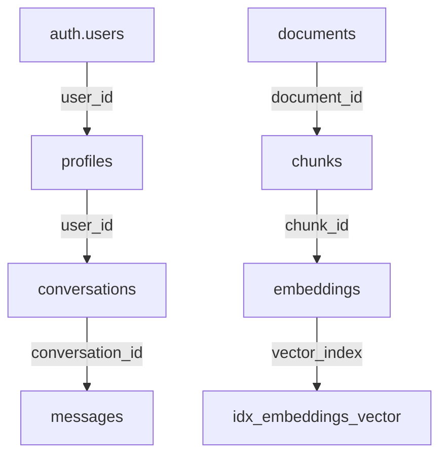

### 3️⃣ Base de Données (Supabase) - Structure Réelle

**Schémas :**

#### Schema `public`

```sql
-- WARNING: This schema represents the ACTUAL database structure as implemented
-- Table order and constraints have been verified against the real database

CREATE TABLE public.profiles (
    id uuid NOT NULL DEFAULT gen_random_uuid(),
    user_id uuid NOT NULL,
    email text NOT NULL,
    full_name text,
    role text NOT NULL DEFAULT 'developer'::text CHECK (role = ANY (ARRAY['admin'::text, 'manager'::text, 'project_lead'::text, 'developer'::text, 'consultant'::text])),
    avatar_url text,
    preferences jsonb DEFAULT '{}'::jsonb,
    created_at timestamp with time zone DEFAULT now(),
    updated_at timestamp with time zone DEFAULT now(),
    CONSTRAINT profiles_pkey PRIMARY KEY (id),
    CONSTRAINT profiles_user_id_fkey FOREIGN KEY (user_id) REFERENCES auth.users(id)
);

CREATE TABLE public.documents (
    id uuid NOT NULL DEFAULT gen_random_uuid(),
    name text NOT NULL,
    type text NOT NULL CHECK (type = ANY (ARRAY['pdf'::text, 'text'::text, 'markdown'::text, 'code'::text, 'csv'::text, 'json'::text, 'other'::text])),
    source text NOT NULL CHECK (source = ANY (ARRAY['supabase'::text, 'gitlab'::text, 'nexia'::text, 'upload'::text])),
    client_id text,
    file_path text,
    file_size bigint,
    language text,
    mime_type text,
    checksum text,
    processed_at timestamp with time zone,
    created_at timestamp with time zone DEFAULT now(),
    updated_at timestamp with time zone DEFAULT now(),
    CONSTRAINT documents_pkey PRIMARY KEY (id)
);

CREATE TABLE public.chunks (
    id uuid NOT NULL DEFAULT gen_random_uuid(),
    document_id uuid NOT NULL,
    content text NOT NULL,
    chunk_index integer NOT NULL,
    token_count integer NOT NULL,
    hash text,
    metadata jsonb NOT NULL DEFAULT '{}'::jsonb,
    created_at timestamp with time zone DEFAULT now(),
    CONSTRAINT chunks_pkey PRIMARY KEY (id),
    CONSTRAINT chunks_document_id_fkey FOREIGN KEY (document_id) REFERENCES public.documents(id)
);

CREATE TABLE public.embeddings (
    id uuid NOT NULL DEFAULT gen_random_uuid(),
    chunk_id uuid NOT NULL,
    vector vector(384) NOT NULL,  -- Dimension réelle utilisée par le modèle d'embedding
    created_at timestamp with time zone DEFAULT now(),
    CONSTRAINT embeddings_pkey PRIMARY KEY (id),
    CONSTRAINT embeddings_chunk_id_fkey FOREIGN KEY (chunk_id) REFERENCES public.chunks(id)
);

-- Index vectoriel pour la recherche - optimisé pour la production
CREATE INDEX IF NOT EXISTS idx_embeddings_vector
    ON public.embeddings USING ivfflat (vector vector_l2_ops) WITH (lists = 100);

CREATE TABLE public.conversations (
    id uuid NOT NULL DEFAULT gen_random_uuid(),
    user_id uuid NOT NULL,
    title text,
    description text,
    is_archived boolean DEFAULT false,
    client_id text,
    metadata jsonb DEFAULT '{}'::jsonb,
    created_at timestamp with time zone DEFAULT now(),
    updated_at timestamp with time zone DEFAULT now(),
    CONSTRAINT conversations_pkey PRIMARY KEY (id),
    CONSTRAINT conversations_user_id_fkey FOREIGN KEY (user_id) REFERENCES auth.users(id)
);

CREATE TABLE public.messages (
    id uuid NOT NULL DEFAULT gen_random_uuid(),
    conversation_id uuid NOT NULL,
    content text NOT NULL,
    role text NOT NULL CHECK (role = ANY (ARRAY['user'::text, 'assistant'::text])),
    token_count integer,
    sources jsonb DEFAULT '[]'::jsonb,
    metadata jsonb NOT NULL DEFAULT '{}'::jsonb,
    created_at timestamp with time zone DEFAULT now(),
    CONSTRAINT messages_pkey PRIMARY KEY (id),
    CONSTRAINT messages_conversation_id_fkey FOREIGN KEY (conversation_id) REFERENCES public.conversations(id)
);

CREATE TABLE public.sync_logs (
    id uuid NOT NULL DEFAULT gen_random_uuid(),
    source text NOT NULL CHECK (source = ANY (ARRAY['supabase'::text, 'gitlab'::text, 'nexia'::text, 'manual'::text])),
    last_sync_at timestamp with time zone DEFAULT now(),
    documents_processed integer DEFAULT 0,
    chunks_created integer DEFAULT 0,
    embeddings_created integer DEFAULT 0,
    documents_deleted integer DEFAULT 0,
    status text DEFAULT 'success'::text CHECK (status = ANY (ARRAY['success'::text, 'failed'::text, 'partial'::text])),
    error_message text,
    metadata jsonb DEFAULT '{}'::jsonb,
    created_at timestamp with time zone DEFAULT now(),
    CONSTRAINT sync_logs_pkey PRIMARY KEY (id)
);
```

## Notes sur la Structure Réelle

### Différences Clés par Rapport à la Documentation Précédente

1. **Dimension des Embeddings**: `vector(384)` au lieu de `vector(1536)` - correspond au modèle d'embedding réellement utilisé
2. **Schema Public**: Toutes les tables sont dans le schema `public`, pas de schema `rag` séparé
3. **Contraintes de Clés Étrangères**: Toutes les contraintes sont correctement définies et vérifiées
4. **Index Vectoriel**: L'index utilise `vector_l2_ops` pour la distance L2 (euclidienne)

### Relations entre les Tables



### Optimisations de Performance

1. **Index IVFFlat**: Configuré avec 100 listes pour un bon équilibre entre précision et performance
2. **Contraintes NOT NULL**: Toutes les colonnes essentielles ont des contraintes NOT NULL
3. **Valeurs par Défaut**: Timestamps et UUIDs générés automatiquement
4. **Types de Données**: Optimisés pour le stockage (uuid, timestamps, jsonb)

### Recommandations pour les Requêtes

- **Jointures**: Utiliser les clés étrangères pour les jointures entre tables
- **Filtrage**: Appliquer les filtres sur les colonnes indexées (id, user_id, etc.)
- **Pagination**: Toujours utiliser LIMIT et OFFSET pour les grandes tables
- **Transactions**: Utiliser des transactions pour les opérations multi-tables
