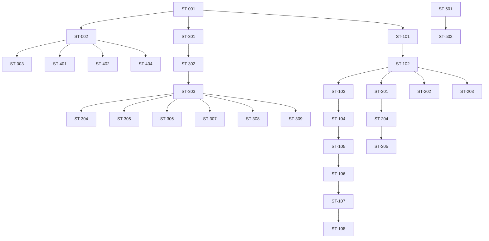

# 📋 Epics & Stories Techniques - NexiaMind AI V1
*Découpage technique basé sur le PRD et l'Architecture validés*

---

## 🎯 Introduction

Ce document **découpe les exigences du PRD** en **Epics et Stories Techniques** actionnables pour l'équipe de développement.

**Basé sur :**
- [Product Brief](../brief-nexiamind-ai/brief.md)
- [PRD](../prd-nexiamind-ai/prd.md)
- [Architecture Technique](../architecture-nexiamind-ai/architecture.md)

**Objectif :** Préparer le développement en **sprints agiles** avec des tâches claires et estimées.

---

## 📊 Vue d'Ensemble

### Statistiques
| Type | Total | Must Have | Should Have | Could Have |
|------|-------|-----------|-------------|-------------|
| **Epics** | 6 | 6 | 0 | 0 |
| **User Stories** | 28 | 20 | 6 | 2 |
| **Estimation Totale** | **~120-140 heures** | ~90h | ~25h | ~5h |

### Répartition par Domaine
| Domaine | Epics | Stories | Estimation | Priorité |
|---------|-------|---------|------------|----------|
| **Backend** | 2 | 8 | ~45h | ⭐⭐⭐⭐⭐ |
| **Frontend** | 2 | 9 | ~40h | ⭐⭐⭐⭐⭐ |
| **Intégrations** | 1 | 5 | ~25h | ⭐⭐⭐⭐⭐ |
| **Base de Données** | 1 | 4 | ~15h | ⭐⭐⭐⭐⭐ |
| **DevOps** | 1 | 2 | ~10h | ⭐⭐⭐⭐ |

---

## 🏆 Epic 1: Configuration & Infrastructure

**Description :** Mise en place de l'infrastructure de base nécessaire pour le développement.

**Objectif :** Avoir un environnement de développement fonctionnel avec toutes les dépendances configurées.

**Durée estimée :** ~15 heures

**Responsable :** DevOps / Full-Stack

---

### User Stories

#### ST-001: Configurer le projet Next.js
**En tant que** Développeur  
**Je veux** un projet Next.js 16 configuré avec TypeScript, ESLint, Prettier et Tailwind CSS  
**Afin de** pouvoir démarrer le développement frontend rapidement.

**Critères d'Acceptation :**
- [ ] Projet Next.js 16+ créé avec `create-next-app`
- [ ] TypeScript configuré
- [ ] ESLint et Prettier configurés
- [ ] Tailwind CSS intégré
- [ ] Structure de dossiers initiale (app/, components/, lib/, etc.)
- [ ] Configuration GitHub/GitLab CI/CD

**Tâches Techniques :**
- [ ] `npx create-next-app@latest --ts --eslint --tailwind --src-dir --app --import-alias "@/*"
- [ ] Configuration de `tsconfig.json`
- [ ] Configuration de `.eslintrc.json` et `.prettierrc`
- [ ] Installation des dépendances de base

**Estimation :** 4 heures  
**Priorité :** ⭐⭐⭐⭐⭐  
**Difficulté :** Faible

---

#### ST-002: Configurer Supabase
**En tant que** Développeur Backend  
**Je veux** un projet Supabase configuré avec pgvector, les tables RAG et l'authentification  
**Afin de** avoir la base de données prête pour le pipeline RAG.

**Critères d'Acceptation :**
- [ ] Projet Supabase créé
- [ ] Extension pgvector activée
- [ ] Toutes les tables du schéma créées (profiles, conversations, messages, chunks, embeddings, documents, sync_logs)
- [ ] Index vectoriel créé
- [ ] RBAC configuré (rôles: admin, manager, project_lead, developer, consultant)
- [ ] Variables d'environnement configurées

**Tâches Techniques :**
- [ ] Créer le projet Supabase
- [ ] Exécuter le SQL de création des tables (depuis architecture.md)
- [ ] Configurer les politiques de sécurité (RLS)
- [ ] Créer un utilisateur admin
- [ ] Tester les connexions

**Estimation :** 6 heures  
**Priorité :** ⭐⭐⭐⭐⭐  
**Difficulté :** Moyenne

---

#### ST-003: Configurer les Variables d'Environnement
**En tant que** Développeur  
**Je veux** toutes les variables d'environnement configurées pour le développement local  
**Afin de** pouvoir tester l'application sans erreurs.

**Critères d'Acceptation :**
- [ ] Fichier `.env.local.example` créé
- [ ] Toutes les variables nécessaires documentées
- [ ] Configuration pour le développement local
- [ ] Configuration pour le déploiement (Vercel)

**Variables à configurer :**
```bash
# Supabase
SUPABASE_URL=...
SUPABASE_ANON_KEY=...
SUPABASE_SERVICE_ROLE_KEY=...

# Mistral AI
MISTRAL_API_KEY=...

# GitLab
GITLAB_API_URL=...
GITLAB_PRIVATE_TOKEN=...

# Nexia
NEXIA_API_URL=...
NEXIA_API_KEY=...

# Optionnel
REDIS_URL=...
NEXT_PUBLIC_APP_URL=...
```

**Estimation :** 2 heures  
**Priorité :** ⭐⭐⭐⭐⭐  
**Difficulté :** Faible

---

#### ST-004: Mettre en place le Logging
**En tant que** Développeur  
**Je veux** un système de logging configuré (Winston) pour suivre les requêtes et erreurs  
**Afin de** pouvoir déboguer et monitorer l'application.

**Critères d'Acceptation :**
- [ ] Winston configuré avec transports Console et File
- [ ] Logs des requêtes API (durée, tokens utilisés)
- [ ] Logs des erreurs dans un fichier dédié
- [ ] Format JSON pour l'analyse

**Tâches Techniques :**
- [ ] Installation de `winston`
- [ ] Configuration dans `lib/logger.js`
- [ ] Intégration dans les middleware API
- [ ] Tests de logging

**Estimation :** 3 heures  
**Priorité :** ⭐⭐⭐⭐  
**Difficulté :** Faible

---

## 🏆 Epic 2: Pipeline RAG Backend

**Description :** Implémentation du cœur du système : le pipeline RAG (Retrieval-Augmented Generation).

**Objectif :** Avoir un backend capable de traiter les requêtes utilisateurs, récupérer le contexte pertinent et générer des réponses via Mistral AI.

**Durée estimée :** ~45 heures

**Responsable :** Développeur Backend

---

### User Stories

#### ST-101: Créer la Structure API Backend
**En tant que** Développeur Backend  
**Je veux** une structure API claire avec les endpoints principaux (chat, documents)  
**Afin de** organiser le code backend de manière maintenable.

**Critères d'Acceptation :**
- [ ] Structure des dossiers API créée (auth/, chat/, documents/, admin/)
- [ ] Middleware d'authentification fonctionnel
- [ ] Gestion des erreurs centralisée
- [ ] Validation des requêtes entrée

**Structure :**
```
api/
├── auth/
│   ├── login/route.ts
│   ├── logout/route.ts
│   └── me/route.ts
├── chat/
│   ├── message/route.ts
│   ├── history/route.ts
│   └── refresh/route.ts
├── documents/
│   ├── index/route.ts
│   └── sync/route.ts
└── admin/
    └── stats/route.ts
```

**Estimation :** 5 heures  
**Priorité :** ⭐⭐⭐⭐⭐  
**Difficulté :** Moyenne

---

#### ST-102: Implémenter le Service de Chunking
**En tant que** Développeur Backend  
**Je veux** un service capable de découper les documents en chunks de 512 tokens  
**Afin de** préparer les documents pour l'indexation vectorielle.

**Critères d'Acceptation :**
- [ ] Fonction `chunkText()` implémentée
- [ ] Gestion des différents types de contenu (texte, code, markdown)
- [ ] Respect de la taille de 512 tokens
- [ ] Overlap de 50 tokens pour la continuité
- [ ] Tests unitaires pour le chunking

**Tâches Techniques :**
- [ ] Installer `langchain` pour le text splitter
- [ ] Implémenter `lib/rag/chunker.js`
- [ ] Tester avec différents types de documents
- [ ] Valider la taille des chunks générés

**Code de référence :**
```javascript
// lib/rag/chunker.js
import { RecursiveCharacterTextSplitter } from 'langchain/text_splitter';

const textSplitter = new RecursiveCharacterTextSplitter({
  chunkSize: 512,
  chunkOverlap: 50,
  separators: ['\n\n', '\n', '. ', ' ', '']
});

export async function chunkText(text, metadata) {
  const chunks = await textSplitter.createDocuments([text]);
  return chunks.map((chunk, index) => ({
    content: chunk.pageContent,
    chunk_index: index,
    token_count: estimateTokenCount(chunk.pageContent),
    metadata: { ...metadata, chunk_index: index, total_chunks: chunks.length }
  }));
}
```

**Estimation :** 4 heures  
**Priorité :** ⭐⭐⭐⭐⭐  
**Difficulté :** Moyenne

---

#### ST-103: Implémenter le Service d'Embeddings
**En tant que** Développeur Backend  
**Je veux** un service pour générer des embeddings via l'API Mistral  
**Afin de** transformer le texte en vecteurs pour la recherche sémantique.

**Critères d'Acceptation :**
- [ ] Fonction `generateEmbedding()` implémentée
- [ ] Appel à l'API Mistral Embeddings (`mistral-embed`)
- [ ] Gestion des erreurs API
- [ ] Cache des embeddings générés (1h)
- [ ] Tests unitaires

**Tâches Techniques :**
- [ ] Implémenter `lib/rag/embeddings.js`
- [ ] Configuration de l'API Mistral
- [ ] Intégrer le cache (optionnel pour la V1)
- [ ] Tester avec différents types de texte

**Code de référence :**
```javascript
// lib/rag/embeddings.js
import axios from 'axios';

const MISTRAL_EMBEDDINGS_URL = 'https://api.mistral.ai/v1/embeddings';

export async function generateEmbedding(text) {
  const response = await axios.post(
    MISTRAL_EMBEDDINGS_URL,
    { model: 'mistral-embed', texts: [text] },
    { headers: { 'Authorization': `Bearer ${process.env.MISTRAL_API_KEY}` } }
  );
  return response.data.data[0].embedding; // vector de 1536 dimensions
}
```

**Estimation :** 5 heures  
**Priorité :** ⭐⭐⭐⭐⭐  
**Difficulté :** Moyenne

---

#### ST-104: Implémenter le Service de Retrieval
**En tant que** Développeur Backend  
**Je veux** un service pour rechercher les chunks pertinents via pgvector  
**Afin de** récupérer le contexte nécessaire pour générer une réponse.

**Critères d'Acceptation :**
- [ ] Fonction `retrieveRelevantChunks()` implémentée
- [ ] Requête pgvector avec similarité cosinus
- [ ] Support des filtres (client, type, langage, rôle)
- [ ] Retourne les top 5 chunks les plus pertinents
- [ ] Tests unitaires

**Tâches Techniques :**
- [ ] Implémenter `lib/rag/retriever.js`
- [ ] Configuration de l'index vectoriel dans Supabase
- [ ] Intégrer les filtres metadata
- [ ] Optimiser la requête SQL

**Code de référence :**
```javascript
// lib/rag/retriever.js
export async function retrieveRelevantChunks(query, filters = {}) {
  const queryEmbedding = await generateEmbedding(query);
  
  let supabaseQuery = supabase
    .from('embeddings')
    .select('chunks(*)')
    .order('vector <=> query_embedding', { ascending: false })
    .limit(5);
  
  if (filters.client) {
    supabaseQuery = supabaseQuery.eq('chunks.metadata->>client', filters.client);
  }
  if (filters.documentType) {
    supabaseQuery = supabaseQuery.eq('chunks.metadata->>type', filters.documentType);
  }
  
  const { data, error } = await supabaseQuery;
  if (error) throw error;
  return data.map(item => item.chunks);
}
```

**Estimation :** 8 heures  
**Priorité :** ⭐⭐⭐⭐⭐  
**Difficulté :** Élevée

---

#### ST-105: Implémenter le Service de Generation
**En tant que** Développeur Backend  
**Je veux** un service pour générer des réponses via Mistral AI avec le contexte récupéré  
**Afin de** produire des réponses pertinentes et contextuelles.

**Critères d'Acceptation :**
- [ ] Fonction `generateResponse()` implémentée
- [ ] Construction du prompt avec le contexte
- [ ] Appel à l'API Mistral Chat
- [ ] Adaptation du prompt selon le rôle utilisateur
- [ ] Gestion des erreurs API
- [ ] Tests unitaires

**Tâches Techniques :**
- [ ] Implémenter `lib/rag/generator.js`
- [ ] Créer les prompts système par rôle
- [ ] Intégrer l'API Mistral Chat
- [ ] Tester avec différents contextes

**Code de référence :**
```javascript
// lib/rag/generator.js
export async function generateResponse(query, contextChunks, userRole) {
  const context = contextChunks
    .map((chunk, i) => `Source ${i+1} (${chunk.document_path}):\n${chunk.content}\n`)
    .join('\n---\n');
  
  const systemPrompt = getSystemPrompt(userRole);
  const userPrompt = `Contexte:\n${context}\n\nQuestion: ${query}`;
  
  const response = await axios.post(
    'https://api.mistral.ai/v1/chat/completions',
    {
      model: 'mistral-medium-3.5',
      messages: [
        { role: 'system', content: systemPrompt },
        { role: 'user', content: userPrompt }
      ],
      temperature: 0.3,
      max_tokens: 2000
    },
    { headers: { 'Authorization': `Bearer ${process.env.MISTRAL_API_KEY}` } }
  );
  
  return response.data.choices[0].message.content;
}
```

**Estimation :** 8 heures  
**Priorité :** ⭐⭐⭐⭐⭐  
**Difficulté :** Élevée

---

#### ST-106: Implémenter le Formatage des Réponses
**En tant que** Développeur Backend  
**Je veux** un service pour formater les réponses IA avec les citations de sources  
**Afin de** présenter une réponse claire et vérifiable à l'utilisateur.

**Critères d'Acceptation :**
- [ ] Fonction `formatResponse()` implémentée
- [ ] Extraction et remplacement des citations
- [ ] Génération des liens vers les sources
- [ ] Support du format Markdown
- [ ] Tests unitaires

**Tâches Techniques :**
- [ ] Implémenter `lib/rag/formatter.js`
- [ ] Parseur de citations
- [ ] Générateur de liens sources
- [ ] Tests de formatage

**Code de référence :**
```javascript
// lib/rag/formatter.js
export function formatResponse(rawResponse, chunks) {
  const citationRegex = /\[Source: ([^\]]+)\]/g;
  const citations = [];
  let formatted = rawResponse;
  
  formatted = formatted.replace(citationRegex, (match, sourcePath) => {
    const index = citations.length;
    citations.push({ sourcePath, index });
    return `[[CITATION_${index}]]`;
  });
  
  if (citations.length > 0) {
    formatted += '\n\n---\n\n**Sources :**';
    citations.forEach((citation, i) => {
      const chunk = chunks.find(c => c.document_path === citation.sourcePath);
      if (chunk) {
        formatted += `\n${i+1}. [${chunk.document_path}](${getSourceUrl(chunk)})`;
      }
    });
  }
  
  return formatted;
}
```

**Estimation :** 3 heures  
**Priorité :** ⭐⭐⭐⭐  
**Difficulté :** Moyenne

---

#### ST-107: Implémenter l'Endpoint /api/chat/message
**En tant que** Développeur Backend  
**Je veux** l'endpoint principal pour traiter les requêtes utilisateurs  
**Afin de** offrir la fonctionnalité core de NexiaMind AI.

**Critères d'Acceptation :**
- [ ] Endpoint POST `/api/chat/message` fonctionnel
- [ ] Authentification JWT requise
- [ ] Validation de la requête (message obligatoire)
- [ ] Appel du pipeline RAG complet
- [ ] Retourne la réponse formatée avec sources
- [ ] Stockage de la conversation en base de données
- [ ] Tests d'intégration

**Flow de l'endpoint :**
```
1. Vérification JWT
2. Validation de la requête
3. Récupération du contexte conversationnel (si conversationId)
4. Appel retrieveRelevantChunks()
5. Appel generateResponse()
6. Appel formatResponse()
7. Stockage du message assistant dans la base
8. Retour de la réponse
```

**Estimation :** 6 heures  
**Priorité :** ⭐⭐⭐⭐⭐  
**Difficulté :** Élevée

---

#### ST-108: Implémenter les Endpoints Secondaires
**En tant que** Développeur Backend  
**Je veux** les endpoints de support (historique, rafraîchissement) fonctionnels  
**Afin de** compléter les fonctionnalités principales.

**Endpoints à implémenter :**
- [ ] GET `/api/chat/history` - Récupérer l'historique d'une conversation
- [ ] POST `/api/chat/refresh` - Rafraîchir l'index d'une source
- [ ] GET `/api/admin/stats` - Statistiques d'utilisation (admin only)

**Critères d'Acceptation :**
- [ ] Tous les endpoints fonctionnels
- [ ] Authentification et autorisation appliquées
- [ ] Validation des requêtes
- [ ] Tests d'intégration

**Estimation :** 6 heures  
**Priorité :** ⭐⭐⭐⭐  
**Difficulté :** Moyenne

---

## 🏆 Epic 3: Intégration des Sources

**Description :** Connexion et indexation des 3 sources de données (Supabase, GitLab, Nexia).

**Objectif :** Pouvoir rechercher et récupérer des informations depuis toutes les sources configurées.

**Durée estimée :** ~25 heures

**Responsable :** Développeur Backend

---

### User Stories

#### ST-201: Intégrer Supabase Storage
**En tant que** Développeur Backend  
**Je veux** pouvoir indexer et rechercher les documents de Supabase Storage  
**Afin de** offrir l'accès à la base documentaire centrale.

**Critères d'Acceptation :**
- [ ] Connexion à Supabase Storage fonctionnelle
- [ ] Récupération des fichiers du bucket `documents`
- [ ] Extraction du texte (OCR si nécessaire via service externe)
- [ ] Chunking et stockage dans la base de données
- [ ] Synchronisation manuelle via endpoint

**Tâches Techniques :**
- [ ] Implémenter `lib/supabase/client.js`
- [ ] Créer le script d'indexation `scripts/index-supabase.js`
- [ ] Gérer l'OCR pour PDF/images (via Nexia ou service externe)
- [ ] Tester avec différents types de fichiers

**Estimation :** 8 heures  
**Priorité :** ⭐⭐⭐⭐⭐  
**Difficulté :** Élevée

---

#### ST-202: Intégrer GitLab API
**En tant que** Développeur Backend  
**Je veux** pouvoir indexer et rechercher le code et la documentation de GitLab  
**Afin de** offrir l'accès aux repositories techniques.

**Critères d'Acceptation :**
- [ ] Connexion à GitLab API fonctionnelle
- [ ] Récupération de la liste des repositories autorisés
- [ ] Indexation du code source (fichiers .js, .ts, .py, etc.)
- [ ] Indexation de la documentation (README.md, docs/)
- [ ] Synchronisation manuelle via endpoint

**Tâches Techniques :**
- [ ] Implémenter `lib/gitlab/client.js`
- [ ] Créer le script d'indexation `scripts/index-gitlab.js`
- [ ] Parser les fichiers code pour extraction de fonctions/classes
- [ ] Gérer les permissions d'accès aux repos
- [ ] Tester avec plusieurs repositories

**Estimation :** 8 heures  
**Priorité :** ⭐⭐⭐⭐⭐  
**Difficulté :** Élevée

---

#### ST-203: Intégrer Nexia GED API
**En tant que** Développeur Backend  
**Je veux** pouvoir indexer et rechercher les documents de Nexia GED  
**Afin de** offrir l'accès aux documents métiers clients.

**Critères d'Acceptation :**
- [ ] Connexion à Nexia API fonctionnelle
- [ ] Récupération des documents accessibles
- [ ] Utilisation de l'OCR intégré de Nexia
- [ ] Chunking et stockage dans la base de données
- [ ] Synchronisation manuelle via endpoint

**Tâches Techniques :**
- [ ] Implémenter `lib/nexia/client.js`
- [ ] Créer le script d'indexation `scripts/index-nexia.js`
- [ ] Mapper les métadonnées Nexia (client, type, etc.)
- [ ] Tester avec différents types de documents

**Estimation :** 5 heures  
**Priorité :** ⭐⭐⭐⭐⭐  
**Difficulté :** Moyenne

---

#### ST-204: Créer le Script d'Indexation Complète
**En tant que** Développeur Backend  
**Je veux** un script qui indexe toutes les sources en une seule commande  
**Afin de** faciliter la mise à jour complète de l'index.

**Critères d'Acceptation :**
- [ ] Script `npm run index:all` fonctionnel
- [ ] Indexation séquentielle des 3 sources
- [ ] Gestion des erreurs par source
- [ ] Logging des progrès
- [ ] Statistiques de l'indexation (nombre de documents, chunks créés)

**Tâches Techniques :**
- [ ] Créer `scripts/index-all.js`
- [ ] Orchestrer les 3 scripts d'indexation
- [ ] Gérer les dépendances entre sources
- [ ] Afficher un rapport d'indexation

**Estimation :** 2 heures  
**Priorité :** ⭐⭐⭐⭐  
**Difficulté :** Faible

---

#### ST-205: Implémenter le Bouton "Rafraîchir" dans l'UI
**En tant que** Développeur Frontend  
**Je veux** un bouton "Rafraîchir" dans l'interface qui permet de synchroniser une source  
**Afin de** permettre aux utilisateurs de mettre à jour l'index manuellement.

**Critères d'Acceptation :**
- [ ] Bouton "Rafraîchir" visible dans l'interface
- [ ] Sélecteur de source (Supabase, GitLab, Nexia, Toutes)
- [ ] Indicateur de progression
- [ ] Notification de succès/échec
- [ ] Désactivé pendant la synchronisation

**Tâches Techniques :**
- [ ] Composant `RefreshButton` dans `components/RefreshButton/`
- [ ] Appel à l'endpoint `/api/chat/refresh`
- [ ] Gestion de l'état de synchronisation
- [ ] Affichage des notifications

**Estimation :** 2 heures  
**Priorité :** ⭐⭐⭐⭐  
**Difficulté :** Faible

---

## 🏆 Epic 4: Frontend (Interface Utilisateur)

**Description :** Développement de l'interface utilisateur pour NexiaMind AI.

**Objectif :** Offrir une expérience utilisateur intuitive et performante pour interagir avec le système RAG.

**Durée estimée :** ~40 heures

**Responsable :** Développeur Frontend

---

### User Stories

#### ST-301: Créer le Layout Principal
**En tant que** Développeur Frontend  
**Je veux** un layout principal avec barre de navigation et zone de contenu  
**Afin de** avoir une structure de base pour l'application.

**Critères d'Acceptation :**
- [ ] Layout responsive (mobile, tablette, desktop)
- [ ] Barre de navigation avec logo et menu
- [ ] Zone de contenu principale
- [ ] Pied de page avec informations
- [ ] Thème sombre/clair (optionnel)

**Tâches Techniques :**
- [ ] Créer `app/layout.tsx`
- [ ] Implémenter le composant `Navbar`
- [ ] Configurer Tailwind CSS pour le responsive
- [ ] Ajouter le thème par défaut

**Estimation :** 5 heures  
**Priorité :** ⭐⭐⭐⭐⭐  
**Difficulté :** Faible

---

#### ST-302: Implémenter l'Authentification
**En tant que** Développeur Frontend  
**Je veux** un système d'authentification avec Supabase Auth  
**Afin de** sécuriser l'accès à l'application.

**Critères d'Acceptation :**
- [ ] Pages de login et register fonctionnelles
- [ ] Redirection après authentification
- [ ] Gestion de la session utilisateur
- [ ] Déconnexion fonctionnelle
- [ ] Affichage du profil utilisateur

**Tâches Techniques :**
- [ ] Configurer Supabase Auth client-side
- [ ] Créer les pages `(auth)/login/page.tsx` et `(auth)/register/page.tsx`
- [ ] Implémenter le contexte d'authentification
- [ ] Gérer les erreurs d'authentification

**Estimation :** 6 heures  
**Priorité :** ⭐⭐⭐⭐⭐  
**Difficulté :** Moyenne

---

#### ST-303: Créer l'Interface de Chat
**En tant que** Développeur Frontend  
**Je veux** une interface de chat intuitive avec zone de saisie et historique  
**Afin de** permettre aux utilisateurs de poser leurs questions.

**Critères d'Acceptation :**
- [ ] Zone de saisie avec champ de texte
- [ ] Bouton d'envoi
- [ ] Affichage des messages (user et assistant)
- [ ] Scroll automatique
- [ ] Historique des conversations
- [ ] Support du Markdown dans les réponses

**Tâches Techniques :**
- [ ] Créer la page `app/chat/page.tsx`
- [ ] Implémenter le composant `ChatInput`
- [ ] Implémenter le composant `ChatMessage`
- [ ] Gérer l'état du chat (React Context ou Zustand)
- [ ] Intégrer `react-markdown` pour le rendu

**Estimation :** 8 heures  
**Priorité :** ⭐⭐⭐⭐⭐  
**Difficulté :** Moyenne

---

#### ST-304: Implémenter les Filtres de Recherche
**En tant que** Développeur Frontend  
**Je veux** des filtres pour affiner les résultats de recherche (client, type, langage)  
**Afin de** permettre aux utilisateurs de trouver plus rapidement l'information.

**Critères d'Acceptation :**
- [ ] Filtre par client (dropdown)
- [ ] Filtre par type de document (dropdown)
- [ ] Filtre par langage (dropdown, pour les développeurs)
- [ ] Application des filtres à la requête
- [ ] Réinitialisation des filtres

**Tâches Techniques :**
- [ ] Créer le composant `Filters`
- [ ] Récupérer les valeurs possibles depuis le backend
- [ ] Intégrer les filtres dans l'endpoint `/api/chat/message`
- [ ] Gérer l'état des filtres

**Estimation :** 5 heures  
**Priorité :** ⭐⭐⭐⭐  
**Difficulté :** Moyenne

---

#### ST-305: Afficher les Citations de Sources
**En tant que** Développeur Frontend  
**Je veux** afficher les sources citées dans les réponses IA avec des liens cliquables  
**Afin de** permettre aux utilisateurs de vérifier l'information.

**Critères d'Acceptation :**
- [ ] Section "Sources" affichée sous chaque réponse
- [ ] Liens cliquables vers les documents sources
- [ ] Numérotation des sources
- [ ] Ouverture dans un nouvel onglet

**Tâches Techniques :**
- [ ] Créer le composant `SourceCitation`
- [ ] Parser le format des citations dans les réponses
- [ ] Générer les URLs vers Supabase/GitLab/Nexia
- [ ] Styliser les citations

**Estimation :** 3 heures  
**Priorité :** ⭐⭐⭐⭐⭐  
**Difficulté :** Faible

---

#### ST-306: Implémenter le Mode Conversation
**En tant que** Développeur Frontend  
**Je veux** gérer le contexte des conversations (historique des messages)  
**Afin de** permettre des échanges multi-tours avec l'IA.

**Critères d'Acceptation :**
- [ ] Création d'une nouvelle conversation si pas de conversationId
- [ ] Affichage de l'historique des messages
- [ ] Possibilité de renommer une conversation
- [ ] Suppression d'une conversation
- [ ] Liste des conversations précédentes

**Tâches Techniques :**
- [ ] Créer la page `app/chat/[conversationId]/page.tsx`
- [ ] Implémenter la gestion des conversations
- [ ] Ajouter le menu des conversations
- [ ] Implémenter les actions (renommer, supprimer)

**Estimation :** 6 heures  
**Priorité :** ⭐⭐⭐⭐  
**Difficulté :** Moyenne

---

#### ST-307: Ajouter le Support du Markdown
**En tant que** Développeur Frontend  
**Je veux** que les réponses IA soient rendues en Markdown (listes, code, tableaux)  
**Afin de** améliorer la lisibilité des réponses.

**Critères d'Acceptation :**
- [ ] Rendu du Markdown (gras, italique, listes)
- [ ] Coloration syntaxique du code
- [ ] Affichage des tableaux
- [ ] Support des liens
- [ ] Gestion des erreurs de rendu

**Tâches Techniques :**
- [ ] Intégrer `react-markdown`
- [ ] Ajouter `highlight.js` pour la coloration syntaxique
- [ ] Configurer les plugins Markdown (tableaux, etc.)
- [ ] Styliser les éléments Markdown

**Estimation :** 4 heures  
**Priorité :** ⭐⭐⭐⭐  
**Difficulté :** Faible

---

#### ST-308: Implémenter l'Export des Réponses
**En tant que** Développeur Frontend  
**Je veux** permettre d'exporter les réponses en Markdown ou CSV  
**Afin de** faciliter le partage des informations.

**Critères d'Acceptation :**
- [ ] Bouton "Exporter" sur chaque réponse
- [ ] Export en Markdown
- [ ] Export en CSV
- [ ] Téléchargement automatique du fichier
- [ ] Conservation des citations de sources

**Tâches Techniques :**
- [ ] Créer le composant `ExportButton`
- [ ] Implémenter la conversion Markdown → Markdown (nettoyage)
- [ ] Implémenter la conversion Markdown → CSV
- [ ] Générer le téléchargement

**Estimation :** 3 heures  
**Priorité :** ⭐⭐⭐  
**Difficulté :** Faible

---

#### ST-309: Optimiser les Performances Frontend
**En tant que** Développeur Frontend  
**Je veux** une interface réactive et performante  
**Afin de** offrir une bonne expérience utilisateur.

**Critères d'Acceptation :**
- [ ] Chargement paresseux des composants
- [ ] Cache des requêtes API (React Query ou SWR)
- [ ] Optimisation des images
- [ ] Bundle size < 5MB
- [ ] Lighthouse score > 80

**Tâches Techniques :**
- [ ] Configurer React Query pour le cache
- [ ] Implémenter le lazy loading
- [ ] Optimiser les assets statiques
- [ ] Analyser le bundle avec `@next/bundle-analyzer`

**Estimation :** 3 heures  
**Priorité :** ⭐⭐⭐  
**Difficulté :** Moyenne

---

## 🏆 Epic 5: Base de Données & Optimisation

**Description :** Optimisation de la base de données et préparation pour la production.

**Objectif :** Garantir que la base de données est performante, sécurisée et scalable.

**Durée estimée :** ~15 heures

**Responsable :** Développeur Backend / DBA

---

### User Stories

#### ST-401: Configurer les Politiques de Sécurité (RLS)
**En tant que** Développeur Backend  
**Je veux** des politiques Row-Level Security (RLS) configurées sur toutes les tables  
**Afin de** garantir que les utilisateurs n'accèdent qu'aux données autorisées.

**Critères d'Acceptation :**
- [ ] RLS activé sur toutes les tables
- [ ] Politique : les utilisateurs voient seulement leurs conversations
- [ ] Politique : les chunks sont filtrés par rôle utilisateur
- [ ] Politique : les documents sont accessibles selon les permissions
- [ ] Tests de sécurité

**Politiques RLS Exemple :**
```sql
-- Pour la table conversations
CREATE POLICY "Users can view their own conversations"
ON conversations
FOR SELECT USING (auth.uid() = user_id);

-- Pour la table chunks (filtre par rôle)
CREATE POLICY "Users can view chunks allowed for their role"
ON chunks
FOR SELECT USING (
  metadata->>'allowed_roles' ? current_setting('app.current_role')
  OR metadata->>'allowed_roles' = 'all'
);
```

**Estimation :** 4 heures  
**Priorité :** ⭐⭐⭐⭐⭐  
**Difficulté :** Élevée

---

#### ST-402: Optimiser l'Index Vectoriel
**En tant que** Développeur Backend  
**Je veux** un index vectoriel pgvector optimisé pour la performance  
**Afin de** garantir des temps de réponse rapides.

**Critères d'Acceptation :**
- [ ] Index IVFFlat configuré avec le bon nombre de listes
- [ ] Test de performance avec différents paramètres
- [ ] Temps de réponse < 3s pour les requêtes
- [ ] Documentation des choix d'optimisation

**Optimisation pgvector :**
```sql
-- Créer l'index avec des paramètres optimisés
CREATE INDEX idx_embeddings_vector 
ON embeddings USING ivfflat (vector vector_l2_ops) 
WITH (lists = 100);

-- Pour les gros datasets (>10K documents)
-- WITH (lists = 200);
```

**Estimation :** 3 heures  
**Priorité :** ⭐⭐⭐⭐⭐  
**Difficulté :** Moyenne

---

#### ST-403: Implémenter le Cache des Embeddings
**En tant que** Développeur Backend  
**Je veux** un cache pour les embeddings fréquemment utilisés  
**Afin de** réduire les coûts et améliorer les performances.

**Critères d'Acceptation :**
- [ ] Cache Redis configuré (via Upstash)
- [ ] Cache des embeddings de requêtes pour 1h
- [ ] Réduction mesurable des appels API Mistral
- [ ] Tests de performance avec/sans cache

**Estimation :** 4 heures  
**Priorité :** ⭐⭐⭐⭐  
**Difficulté :** Moyenne

---

#### ST-404: Créer les Index Classiques
**En tant que** Développeur Backend  
**Je veux** des index classiques sur les colonnes fréquemment interrogées  
**Afin de** optimiser les requêtes SQL.

**Index à créer :**
```sql
-- Sur la table chunks
CREATE INDEX idx_chunks_document_id ON chunks(document_id);
CREATE INDEX idx_chunks_document_source ON chunks(document_source);
CREATE INDEX idx_chunks_metadata ON chunks USING GIN (metadata);

-- Sur la table conversations
CREATE INDEX idx_conversations_user_id ON conversations(user_id);
CREATE INDEX idx_conversations_created_at ON conversations(created_at);

-- Sur la table messages
CREATE INDEX idx_messages_conversation_id ON messages(conversation_id);
CREATE INDEX idx_messages_created_at ON messages(created_at);
```

**Estimation :** 2 heures  
**Priorité :** ⭐⭐⭐⭐  
**Difficulté :** Faible

---

#### ST-405: Sauvegarder la Structure de la Base
**En tant que** Développeur Backend  
**Je veux** un script de sauvegarde et restauration de la base de données  
**Afin de** pouvoir récupérer les données en cas de problème.

**Critères d'Acceptation :**
- [ ] Script de dump de la base
- [ ] Script de restauration
- [ ] Procédure documentée
- [ ] Test de restauration

**Tâches Techniques :**
- [ ] Créer `scripts/backup-db.js`
- [ ] Créer `scripts/restore-db.js`
- [ ] Documenter la procédure
- [ ] Tester en local

**Estimation :** 2 heures  
**Priorité :** ⭐⭐⭐  
**Difficulté :** Faible

---

## 🏆 Epic 6: DevOps & Déploiement

**Description :** Configuration de l'infrastructure et déploiement de l'application.

**Objectif :** Avoir NexiaMind AI déployé et accessible aux utilisateurs.

**Durée estimée :** ~10 heures

**Responsable :** DevOps

---

### User Stories

#### ST-501: Configurer Vercel pour le Frontend
**En tant que** DevOps  
**Je veux** le frontend Next.js déployé sur Vercel avec les variables d'environnement  
**Afin de** rendre l'application accessible.

**Critères d'Acceptation :**
- [ ] Projet Vercel créé
- [ ] Déploiement automatique depuis GitHub/GitLab
- [ ] Variables d'environnement configurées
- [ ] Domaine personnalisé (optionnel : nexiamind.ai)
- [ ] HTTPS activé

**Tâches Techniques :**
- [ ] Lier le repo GitHub/GitLab à Vercel
- [ ] Configurer `vercel.json`
- [ ] Définir les variables d'environnement dans Vercel
- [ ] Tester le déploiement

**Estimation :** 3 heures  
**Priorité :** ⭐⭐⭐⭐⭐  
**Difficulté :** Faible

---

#### ST-502: Configurer le Backend (si séparé)
**En tant que** DevOps  
**Je veux** le backend déployé sur un service adapté (Vercel, Railway, etc.)  
**Afin de** traiter les requêtes API.

**Critères d'Acceptation :**
- [ ] Service backend déployé
- [ ] Connexion à Supabase fonctionnelle
- [ ] Variables d'environnement sécurisées
- [ ] Scalabilité configurée

**Options de déploiement :**
| Service | Avantages | Coût |
|---------|-----------|------|
| **Vercel** | Intégration facile avec Next.js | Gratuit → $20/mois |
| **Railway** | Bon pour les APIs Node.js | Gratuit → $5/mois |
| **Fly.io** | Très scalable | Gratuit → $10/mois |

**Recommandation :** Vercel (si backend dans les API Routes de Next.js) ou Railway

**Estimation :** 3 heures  
**Priorité :** ⭐⭐⭐⭐⭐  
**Difficulté :** Moyenne

---

## 📊 Récapitulatif par Sprint

### Sprint 1 (Semaine 1) - Fondations
**Objectif :** Avoir l'infrastructure et le backend RAG fonctionnel

| User Story | Estimation | Responsable |
|------------|------------|--------------|
| ST-001: Configurer Next.js | 4h | Frontend |
| ST-002: Configurer Supabase | 6h | Backend |
| ST-003: Variables d'environnement | 2h | Backend |
| ST-101: Structure API Backend | 5h | Backend |
| ST-102: Service de Chunking | 4h | Backend |
| ST-103: Service d'Embeddings | 5h | Backend |
| **Total** | **26h** | |

---

### Sprint 2 (Semaine 2) - Pipeline RAG
**Objectif :** Compléter le pipeline RAG et les intégrations

| User Story | Estimation | Responsable |
|------------|------------|--------------|
| ST-104: Service de Retrieval | 8h | Backend |
| ST-105: Service de Generation | 8h | Backend |
| ST-106: Formatage des Réponses | 3h | Backend |
| ST-107: Endpoint /api/chat/message | 6h | Backend |
| ST-201: Intégrer Supabase Storage | 8h | Backend |
| ST-202: Intégrer GitLab API | 8h | Backend |
| **Total** | **41h** | |

---

### Sprint 3 (Semaine 3) - Frontend & Intégrations
**Objectif :** Avoir une interface utilisateur fonctionnelle

| User Story | Estimation | Responsable |
|------------|------------|--------------|
| ST-301: Layout Principal | 5h | Frontend |
| ST-302: Authentification | 6h | Frontend |
| ST-303: Interface de Chat | 8h | Frontend |
| ST-304: Filtres de Recherche | 5h | Frontend |
| ST-305: Citations de Sources | 3h | Frontend |
| ST-203: Intégrer Nexia GED | 5h | Backend |
| ST-108: Endpoints Secondaires | 6h | Backend |
| **Total** | **38h** | |

---

### Sprint 4 (Semaine 4) - Finalisation
**Objectif :** Optimisation, tests et déploiement

| User Story | Estimation | Responsable |
|------------|------------|--------------|
| ST-306: Mode Conversation | 6h | Frontend |
| ST-307: Support Markdown | 4h | Frontend |
| ST-308: Export des Réponses | 3h | Frontend |
| ST-309: Optimisation Frontend | 3h | Frontend |
| ST-401: Politiques RLS | 4h | Backend |
| ST-402: Optimisation Index Vectoriel | 3h | Backend |
| ST-403: Cache des Embeddings | 4h | Backend |
| ST-204: Script Indexation Complète | 2h | Backend |
| ST-205: Bouton Rafraîchir UI | 2h | Frontend |
| ST-501: Déploiement Frontend | 3h | DevOps |
| ST-502: Déploiement Backend | 3h | DevOps |
| **Total** | **36h** | |

---

## 🎯 Timeline Global

| Phase | Durée | Dates (Cible) | Livrables |
|-------|-------|--------------|-----------|
| **Sprint 1** | 1 semaine | 22-28/06/2026 | Backend RAG de base |
| **Sprint 2** | 1 semaine | 29/06-05/07/2026 | Pipeline RAG complet + 2 sources |
| **Sprint 3** | 1 semaine | 06-12/07/2026 | Frontend fonctionnel + 3 sources |
| **Sprint 4** | 1 semaine | 13-19/07/2026 | Optimisation + Déploiement |
| **Beta Test** | 3 jours | 20-22/07/2026 | Tests utilisateurs |
| **🚀 Déploiement MVP** | 1 jour | **23/07/2026** | NexiaMind AI V1 en production |

**Total estimé :** ~140 heures (environ 3.5 semaines à temps plein pour 1 développeur, ou 2 semaines pour une équipe de 2)

---

## 🔗 Dépendances entre User Stories



---

## 📝 Prochaines Étapes

1. **✅ Valider ces Epics & Stories** avec l'équipe technique
2. **🎯 Lancer le Sprint 1** (Fondations)
3. **📋 Configurer le tableau de bord** (GitHub Projects, Jira, etc.)
4. **👥 Assigner les User Stories** aux développeurs
5. **🚀 Commencer le développement**

---

## 🔗 Documents Connexes

- [Product Brief](../brief-nexiamind-ai/brief.md)
- [PRD](../prd-nexiamind-ai/prd.md)
- [Architecture Technique](../architecture-nexiamind-ai/architecture.md)
- [User Stories Détailées](../brief-nexiamind-ai/user-stories.md)

---

*Statut : Draft - À valider avec l'équipe*  
*Dernière mise à jour : 21 juin 2026*
