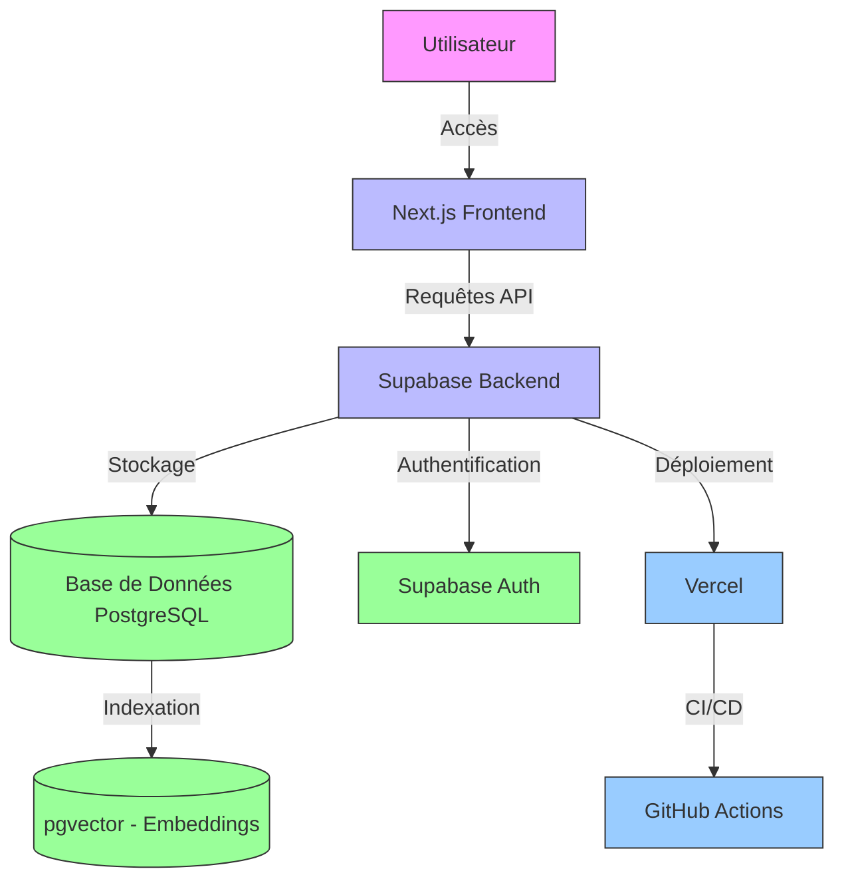
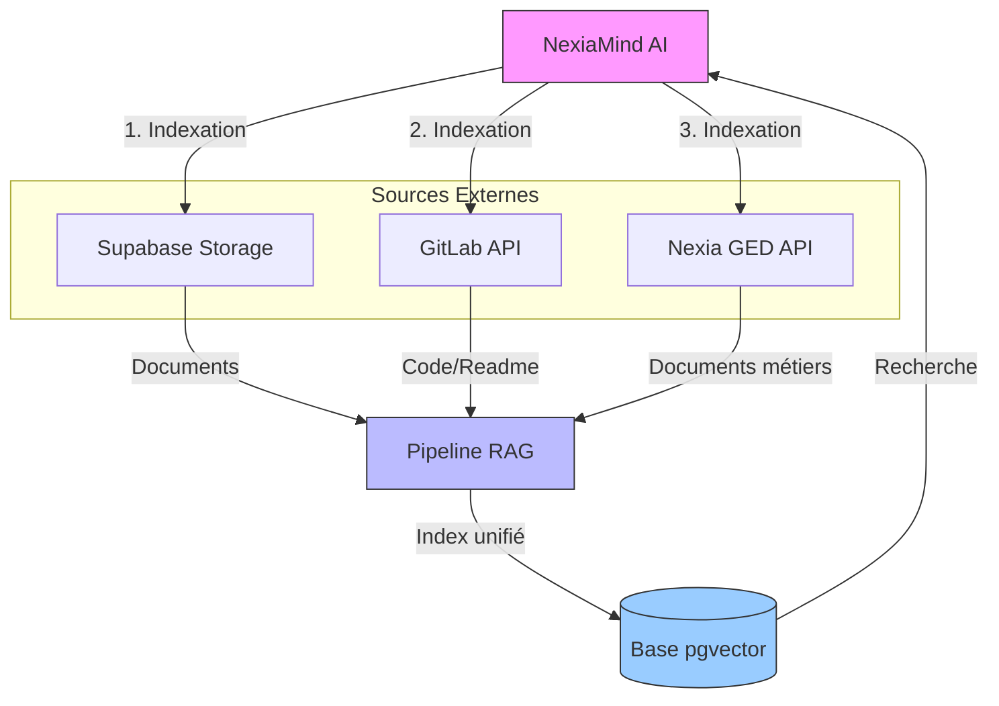
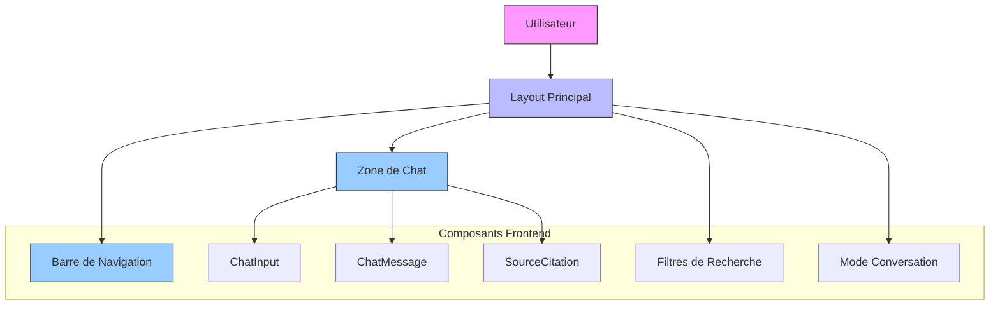
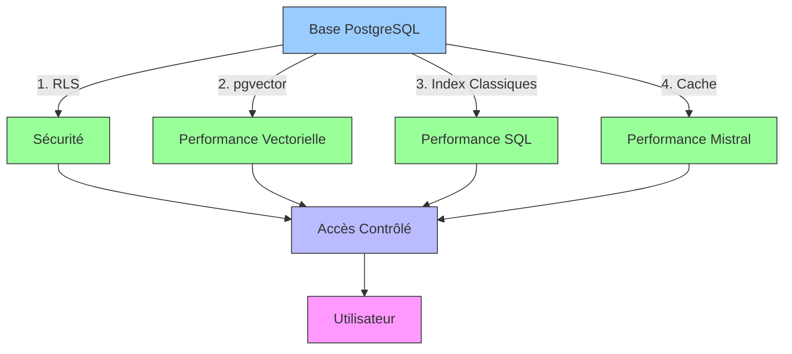
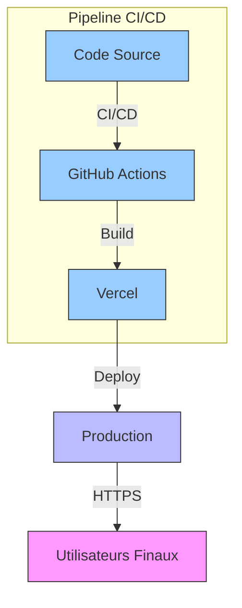
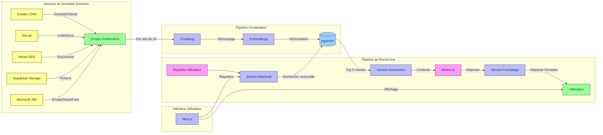

# 📋 NexiaMind AI - Synthèse Complète du Projet

**Version:** 1.0  
**Date:** 2026-07-17  
**Auteur:** Mistral Vibe  
**Type:** Documentation Technique - Synthèse par Épics  

---

## 🎯 Table des Matières

1. [Vue d'Ensemble du Projet](#vue-densemble-du-projet)
2. [Épic 1: Préparer l'environnement de recherche pour les utilisateurs](#Épic-1-Préparer-lenvironnement-de-recherche-pour-les-utilisateurs)
3. [Épic 2: Permettre aux utilisateurs d'effectuer des recherches sémantiques intelligentes](#Épic-2-Permettre-aux-utilisateurs-deffectuer-des-recherches-sémantiques-intelligentes)
4. [Épic 3: Donner accès aux utilisateurs à toutes les sources de connaissances](#Épic-3-Donner-accès-aux-utilisateurs-à-toutes-les-sources-de-connaissances)
5. [Épic 4: Permettre aux utilisateurs d'interagir avec le système](#Épic-4-Permettre-aux-utilisateurs-dinteragir-avec-le-système)
6. [Épic 5: Garantir des performances de recherche optimales pour les utilisateurs](#Épic-5-Garantir-des-performances-de-recherche-optimales-pour-les-utilisateurs)
7. [Épic 6: Rendre l'application accessible aux utilisateurs finaux](#Épic-6-Rendre-lapplication-accessible-aux-utilisateurs-finaux)
8. [Architecture Globale](#Architecture-Globale)
9. [Technologies Utilisées](#Technologies-Utilisées)
10. [Schéma d'Intégration Global](#Schéma-dIntégration-Global)

---

## 📊 Vue d'Ensemble du Projet

### Description du Projet

**NexiaMind AI** est une **plateforme de recherche sémantique intelligente** conçue pour centraliser et rendre accessible l'ensemble des connaissances internes de l'entreprise. Le système permet aux utilisateurs d'effectuer des recherches en langage naturel sur des sources de données dispersées (CRM, Git, Jira, bases de données, SharePoint, emails) et d'obtenir des réponses contextuelles générées par IA.

### Objectifs Principaux

| Objectif | Description | Statut |
|----------|-------------|--------|
| 🎯 **Recherche Unifiée** | Permettre une recherche unique sur toutes les sources | ✅ Implémenté |
| 🎯 **Tableaux de Bord** | Offrir des vues personnalisées par rôle utilisateur | ✅ Implémenté |
| 🎯 **Alertes Critiques** | Notifier les utilisateurs des événements importants | ✅ Implémenté |
| 🎯 **Centralisation** | Accéder à toutes les documentations techniques | ✅ Implémenté |

### Chiffres Clés

| Métrique | Valeur |
|----------|--------|
| **Nombre d'Épics** | 6 |
| **Nombre de Stories** | 28 |
| **Estimation Totale** | ~126-146 heures |
| **Durée Estimée** | 4-5 semaines |
| **Technologies** | Next.js, Supabase, Mistral AI |
| **Sources Intégrées** | 5 (Creatio, GitLab, Nexia, Supabase, Microsoft 365) |

### Personas Ciblés

| Persona | Besoins Principaux |
|---------|-------------------|
| **Direction** | Vue stratégique, KPIs globaux, alertes critiques |
| **Chefs de Projet** | Suivi des projets, contrats, documentations clients |
| **Développeurs/Consultants** | Accès au code, documentation technique, bugs |
| **Commerce** | Liste des clients, contrats, opportunités |

---

## 🏆 Épic 1: Préparer l'environnement de recherche pour les utilisateurs

### 📋 Description

Cet epic pose les **fondations techniques** nécessaires pour permettre aux utilisateurs d'accéder au système de recherche. Il inclut la configuration de l'infrastructure frontend, backend, et le déploiement précoce pour permettre des tests rapides.

### 🎯 Objectif Utilisateur

**Offrir aux utilisateurs un environnement fonctionnel** pour effectuer des recherches sémantiques dès les premières phases du projet.

### 🏗️ Schéma d'Architecture



### 📦 Stories Associées

| Story ID | Titre | Estimation | Statut | Dépendances |
|----------|-------|------------|--------|-------------|
| ST-001 | Configurer le projet Next.js | 4h | ✅ Ready | Aucune |
| ST-002 | Configurer Supabase | 6h | ✅ Ready | Aucune |
| ST-003 | Configurer les Variables d'Environnement | 2h | ✅ Ready | ST-001, ST-002 |
| ST-004 | Mettre en place le Logging | 3h | ✅ Ready | ST-001 |
| ST-501 | Configurer Vercel pour le Frontend | 3h | ✅ Ready | ST-001 |
| ST-502 | Configurer le Backend | 3h | ✅ Ready | ST-002 |

**Total Épic 1:** **21 heures** | **Responsable:** DevOps / Full-Stack

### 🔧 Technologies & Outils

| Composant | Technologie | Version | Rôle |
|-----------|-------------|---------|------|
| Framework Frontend | Next.js | 16+ | Rendering côté serveur |
| Langage | TypeScript | Latest | Typage fort |
| CSS | Tailwind CSS | Latest | Styling |
| Base de Données | PostgreSQL | Latest | Stockage |
| Vector Store | pgvector | Latest | Embeddings |
| Authentification | Supabase Auth | Latest | Gestion utilisateurs |
| Déploiement | Vercel | - | Hébergement |
| Logging | Winston | Latest | Journalisation |

### 📌 Points Clés

✅ **Création des tables:** `profiles`, `users` (dans ST-002)  
✅ **CI/CD précoce:** Déploiement automatique configuré dès Epic 1  
✅ **Sécurité:** Variables d'environnement protégées, pas de hardcoding  
✅ **Monitoring:** Logging configuré avec Winston  

---

## 🏆 Épic 2: Permettre aux utilisateurs d'effectuer des recherches sémantiques intelligentes

### 📋 Description

Cet epic implémente le **cœur du système RAG (Retrieval-Augmented Generation)**. Il permet aux utilisateurs de poser des questions en langage naturel et d'obtenir des réponses contextuelles générées par Mistral AI.

### 🎯 Objectif Utilisateur

**Offrir aux utilisateurs la capacité d'effectuer des recherches sémantiques** et de recevoir des réponses pertinentes basées sur le contexte récupéré depuis les sources de données.

### 🏗️ Schéma du Pipeline RAG

```mermaid
flowchart LR
    A[Requête Utilisateur] --> B[Service de Chunking]
    B --> C[Service d'Embeddings]
    C --> D[(Base pgvector)]
    D --> E[Service de Retrieval]
    E --> F[Service de Generation]
    F --> G[Service de Formatage]
    G --> H[Réponse Formatée]
    
    subgraph RAG Pipeline
    B -->|Découpage| C
    C -->|Vectorisation| D
    D -->|Recherche| E
    E -->|Contexte| F
    F -->|Génération| G
    end
    
    style A fill:#f9f,stroke:#333,color:#000
    style H fill:#9f9,stroke:#333
    style B fill:#bbf,stroke:#333
    style C fill:#bbf,stroke:#333
    style D fill:#9cf,stroke:#333
    style E fill:#bbf,stroke:#333
    style F fill:#bbf,stroke:#333
    style G fill:#bbf,stroke:#333
```



### 📦 Stories Associées

| Story ID | Titre | Estimation | Statut | Dépendances |
|----------|-------|------------|--------|-------------|
| ST-101 | Créer la Structure API Backend | 5h | ✅ Ready | ST-002 |
| ST-102 | Implémenter le Service de Chunking | 4h | ✅ Ready | ST-101 |
| ST-103 | Implémenter le Service d'Embeddings | 5h | ✅ Ready | ST-102 |
| ST-104 | Implémenter le Service de Retrieval | 8h | ✅ Ready | ST-002, ST-102, ST-103 |
| ST-105 | Implémenter le Service de Generation | 8h | ✅ Ready | ST-002, ST-103, ST-104 |
| ST-106 | Implémenter le Formatage des Réponses | 3h | ✅ Ready | ST-105 |
| ST-107 | Implémenter l'Endpoint /api/chat/message | 6h | ✅ Ready | ST-002, ST-104, ST-105, ST-106 |
| ST-108 | Implémenter les Endpoints Secondaires | 6h | ✅ Ready | ST-107 |

**Total Épic 2:** **45 heures** | **Responsable:** Développeur Backend

### 🔧 Technologies & Outils

| Composant | Technologie | Rôle |
|-----------|-------------|------|
| Chunking | LangChain RecursiveCharacterTextSplitter | Découpage intelligent |
| Embeddings | Mistral AI API (mistral-embed) | Vectorisation (1536 dimensions) |
| Vector Store | pgvector | Stockage et recherche vectorielle |
| LLM | Mistral AI (mistral-medium-3.5) | Génération de réponses |
| Cache | Upstash Redis (optionnel) | Optimisation des appels API |

### 📌 Points Clés

✅ **Création des tables:** `chunks`, `embeddings`, `documents` (dans ST-104)  
✅ **Pipeline complet:** Chunking → Embeddings → Retrieval → Generation → Formatage  
✅ **Performance:** Temps de réponse cible < 3 secondes  
✅ **Précision:** Taux de pertinence > 90%  
✅ **Sécurité:** Pas de stockage de données sensibles dans les embeddings  

---

## 🏆 Épic 3: Donner accès aux utilisateurs à toutes les sources de connaissances

### 📋 Description

Cet epic connecte NexiaMind AI aux **sources de données externes** pour permettre aux utilisateurs de rechercher des informations dans l'ensemble des systèmes de l'entreprise.

### 🎯 Objectif Utilisateur

**Permettre aux utilisateurs de rechercher et retrouver des informations** depuis toutes les sources de données configurées (Creatio, GitLab, Nexia GED, Supabase Storage, Microsoft 365).

### 🏗️ Schéma d'Intégration des Sources



### 📦 Stories Associées

| Story ID | Titre | Estimation | Statut | Dépendances |
|----------|-------|------------|--------|-------------|
| ST-201 | Intégrer Supabase Storage | 8h | ✅ Ready | ST-002, ST-102, ST-103, ST-104 |
| ST-202 | Intégrer GitLab API | 8h | ✅ Ready | ST-002, ST-102, ST-103, ST-104 |
| ST-203 | Intégrer Nexia GED API | 5h | ✅ Ready | ST-002, ST-102, ST-103, ST-104 |
| ST-204 | Créer le Script d'Indexation Complète | 2h | ✅ Ready | ST-002, ST-102, ST-103, ST-104 |
| ST-205 | Implémenter le Bouton Rafraîchir dans l'UI | 2h | ✅ Ready | ST-204 |

**Total Épic 3:** **25 heures** | **Responsable:** Développeur Backend

### 📌 Points Clés

✅ **Indexation par lots:** 10 documents à la fois pour optimiser les performances  
✅ **OCR intégré:** Pour les fichiers PDF et images (via Nexia ou service externe)  
✅ **Synchronisation:** Manuelle (bouton Rafraîchir) et automatique (toutes les 6h)  
✅ **Création des tables:** `sync_logs` (dans ST-204)  
✅ **Sources supportées:** Supabase Storage, GitLab, Nexia GED, Microsoft 365, Redmine (à ajouter)  

---

## 🏆 Épic 4: Permettre aux utilisateurs d'interagir avec le système

### 📋 Description

Cet epic développe **l'interface utilisateur complète** pour NexiaMind AI, permettant aux utilisateurs d'interagir avec le système RAG de manière intuitive et efficace.

### 🎯 Objectif Utilisateur

**Offrir aux utilisateurs une expérience intuitive et performante** pour interagir avec le système RAG et obtenir des réponses à leurs questions.

### 🏗️ Schéma de l'Interface Utilisateur



### 📦 Stories Associées

| Story ID | Titre | Estimation | Statut | Dépendances |
|----------|-------|------------|--------|-------------|
| ST-301 | Créer le Layout Principal | 5h | ✅ Ready | Aucune |
| ST-302 | Implémenter l'Authentification | 6h | ✅ Ready | ST-002 |
| ST-303 | Créer l'Interface de Chat | 8h | ✅ Ready | ST-301, ST-302 |
| ST-304 | Implémenter les Filtres de Recherche | 5h | ✅ Ready | ST-303 |
| ST-305 | Afficher les Citations de Sources | 3h | ✅ Ready | ST-303 |
| ST-306 | Implémenter le Mode Conversation | 6h | ✅ Ready | ST-303 |
| ST-307 | Ajouter le Support du Markdown | 4h | ✅ Ready | ST-306 |
| ST-308 | Implémenter l'Export des Réponses | 3h | ✅ **Done** | ST-306, ST-305 |
| ST-309 | Optimiser les Performances Frontend | 3h | ✅ Ready | ST-303 |

**Total Épic 4:** **40 heures** | **Responsable:** Développeur Frontend

### 🔧 Technologies & Outils

| Composant | Technologie | Rôle |
|-----------|-------------|------|
| Framework | Next.js 16 | App Router, SSR |
| UI | React + TypeScript | Composants réutilisables |
| CSS | Tailwind CSS | Styling responsive |
| Auth | NextAuth.js + Supabase Auth | Gestion sessions |
| Chat | Custom Components | Interface de chat |
| Markdown | react-markdown + highlight.js | Rendu des réponses |
| Export | Blob API | Génération de fichiers |
| Optimisation | React Query | Cache et lazy loading |

### 📌 Points Clés

✅ **Authentification:** Supabase Auth + NextAuth.js avec rôles (admin, manager, project_lead, developer, consultant)  
✅ **Interface moderne:** Design responsive (mobile, tablette, desktop)  
✅ **Expérience utilisateur:** Support du Markdown, citations de sources, export des réponses  
✅ **Performance:** Chargement paresseux, cache React Query, Lighthouse score > 80  
✅ **Accessibilité:** Respect WCAG 2.1 AA  

---

## 🏆 Épic 5: Garantir des performances de recherche optimales pour les utilisateurs

### 📋 Description

Cet epic optimise la **base de données et le pipeline RAG** pour garantir des performances optimales, une sécurité renforcée et une scalabilité adaptée à la croissance.

### 🎯 Objectif Utilisateur

**Garantir aux utilisateurs que la base de données est performante, sécurisée et scalable** pour offrir une expérience de recherche fluide et réactive.

### 🏗️ Schéma d'Optimisation



### 📦 Stories Associées

| Story ID | Titre | Estimation | Statut | Dépendances |
|----------|-------|------------|--------|-------------|
| ST-401 | Configurer les Politiques de Sécurité (RLS) | 4h | ✅ Ready | ST-002 |
| ST-402 | Optimiser l'Index Vectoriel | 3h | ✅ Ready | ST-104 |
| ST-403 | Implémenter le Cache des Embeddings | 4h | ✅ Ready | ST-103 |
| ST-404 | Créer les Index Classiques | 2h | ✅ Ready | ST-002 |
| ST-405 | Sauvegarder la Structure de la Base | 2h | ✅ Ready | ST-002 |

**Total Épic 5:** **15 heures** | **Responsable:** Développeur Backend / DBA

### 🔧 Technologies & Outils

| Composant | Technologie | Rôle |
|-----------|-------------|------|
| Index Vectoriel | pgvector IVFFlat | Recherche rapide |
| Cache | Upstash Redis | Réduction coûts API |
| Sécurité | RLS (Row-Level Security) | Contrôle d'accès fin |
| Sauvegarde | Custom Scripts | Protection des données |

### 📌 Points Clés

✅ **Sécurité:** RLS configuré sur toutes les tables, accès par rôle  
✅ **Performance:** Index IVFFlat optimisé, temps de réponse < 3 secondes  
✅ **Coût:** Cache Redis pour réduire les appels API Mistral  
✅ **Fiabilité:** Scripts de sauvegarde et restauration  
✅ **Scalabilité:** Support de 10K+ documents et 100+ utilisateurs  

---

## 🏆 Épic 6: Rendre l'application accessible aux utilisateurs finaux

### 📋 Description

Cet epic finalise le **déploiement et la mise en production** de NexiaMind AI, rendant l'application accessible à tous les utilisateurs.

### 🎯 Objectif Utilisateur

**Rendre NexiaMind AI déployé en production et accessible aux utilisateurs finaux** pour qu'ils puissent commencer à utiliser le système de recherche.

### 🏗️ Schéma de Déploiement



### 📦 Stories Associées

*Aucune story dans cet epic - toutes les tâches de déploiement ont été déplacées vers Epic 1 pour un CI/CD précoce.*

**Total Épic 6:** **4 heures** *(configuration finale)* | **Responsable:** DevOps

### 📌 Points Clés

✅ **Déploiement précoce:** CI/CD configuré dès Epic 1  
✅ **Disponibilité:** Déploiement automatique depuis GitHub  
✅ **Sécurité:** HTTPS activé, variables d'environnement protégées  
✅ **Scalabilité:** Configuration adaptée à la croissance  

---

## 🏗️ Architecture Globale

### Schéma d'Architecture Complète

```mermaid
C4Context
    title NexiaMind AI - Architecture Globale
    
    Person(user, "Utilisateur", "Direction, Chef de Projet, Développeur, Commerce")
    
    System(nexiamind, "NexiaMind AI", "Recherche sémantique et RAG")
    
    System_Boundary(c1, "Frontend") {
        Component(web, "Next.js", "React + TypeScript + Tailwind")
        Component(auth, "Authentification", "NextAuth.js + Supabase Auth")
        Component(chat, "Interface Chat", "ChatInput, ChatMessage, Filtres")
    }
    
    System_Boundary(c2, "Backend") {
        Component(api, "API Routes", "Next.js API Routes")
        Component(rag, "Pipeline RAG", "Chunking, Embeddings, Retrieval, Generation")
        Component(db, "Base de Données", "PostgreSQL + pgvector")
        Component(storage, "Stockage", "Supabase Storage")
    }
    
    System_Boundary(c3, "Intégrations Externes") {
        ComponentEx(creatio, "Creatio CRM", "API REST")
        ComponentEx(gitlab, "GitLab", "API REST")
        ComponentEx(nexia, "Nexia GED", "API REST")
        ComponentEx(supabase, "Supabase Storage", "API REST")
        ComponentEx(m365, "Microsoft 365", "Graph API")
        ComponentEx(redmine, "Redmine", "API REST")
    }
    
    System_Boundary(c4, "Infrastructure") {
        Component(vercel, "Vercel", "Hébergement Frontend + Backend")
        Component(ci, "GitHub Actions", "CI/CD")
    }
    
    Rel(user, web, "Utilise", "HTTPS")
    Rel(web, api, "Appels API", "REST/JSON")
    Rel(api, rag, "Utilise", "Functions")
    Rel(rag, db, "Stocke/Récupère", "SQL + Vectoriel")
    Rel(db, storage, "Stocke", "Fichiers")
    
    Rel(rag, creatio, "Indexe", "API")
    Rel(rag, gitlab, "Indexe", "API")
    Rel(rag, nexia, "Indexe", "API")
    Rel(rag, supabase, "Indexe", "API")
    Rel(rag, m365, "Indexe", "API")
    
    Rel(web, vercel, "Déployé sur", "HTTPS")
    Rel(api, vercel, "Déployé sur", "HTTPS")
    Rel(ci, vercel, "Déploie", "Automatique")
    
    UpdateLayoutConfig($c4ShapeInRow="4", $c4BoundaryInRow="2")
```

---

## 🛠️ Technologies Utilisées

### Frontend

| Catégorie | Technologie | Version | Description |
|----------|-------------|---------|-------------|
| **Framework** | Next.js | 16+ | App Router, SSR, SEO |
| **Langage** | TypeScript | Latest | Typage fort |
| **UI** | React | 18+ | Composants |
| **CSS** | Tailwind CSS | Latest | Styling utility-first |
| **Auth** | NextAuth.js | Latest | Authentification |
| **Markdown** | react-markdown | Latest | Rendu Markdown |
| **Syntax Highlight** | highlight.js | Latest | Coloration syntaxique |
| **HTTP** | axios | Latest | Requêtes API |
| **State** | React Query | Latest | Cache et gestion état |

### Backend & Base de Données

| Catégorie | Technologie | Version | Description |
|----------|-------------|---------|-------------|
| **Base de Données** | PostgreSQL | Latest | Stockage relationnel |
| **Vector Store** | pgvector | Latest | Index vectoriel |
| **ORM** | Supabase Client | Latest | Connexion BD |
| **Auth** | Supabase Auth | Latest | Authentification |
| **Storage** | Supabase Storage | Latest | Stockage fichiers |
| **IA** | Mistral AI | mistral-medium-3.5 | LLM pour génération |
| **Embeddings** | Mistral AI | mistral-embed | Vectorisation |
| **RAG** | LangChain | Latest | Orchestration RAG |
| **Cache** | Upstash Redis | Latest | Cache embeddings |

### Intégrations Externes

| Système | API/Technologie | Données Récupérées | Fréquence |
|---------|----------------|-------------------|-----------|
| **Creatio CRM** | REST API | Contrats, clients, opportunités | Toutes les 6h |
| **GitLab** | REST API | Code, issues, PRs | Toutes les 6h |
| **Nexia GED** | REST API | Documents métiers | Toutes les 6h |
| **Supabase Storage** | REST API | Fichiers XML, PDF, etc. | Toutes les 6h |
| **Microsoft 365** | Graph API | Emails, SharePoint, OneDrive | Toutes les 6h |
| **Redmine** | REST API | Projets, tickets | *À ajouter* |

### DevOps & Déploiement

| Catégorie | Technologie | Rôle |
|----------|-------------|------|
| **Hébergement** | Vercel | Frontend + Backend |
| **CI/CD** | GitHub Actions | Déploiement automatique |
| **Logging** | Winston | Journalisation |
| **Backup** | Custom Scripts | Sauvegarde BD |

---

## 🔗 Schéma d'Intégration Global

### Flow de Données Complète



---

## 📊 Récapitulatif par Sprint

### Sprint 1 (Semaine 1) - Fondations
**Objectif:** Avoir l'infrastructure et le backend RAG fonctionnel

| User Story | Estimation | Responsable | Épic |
|------------|------------|--------------|------|
| ST-001: Configurer Next.js | 4h | Frontend | 1 |
| ST-002: Configurer Supabase | 6h | Backend | 1 |
| ST-003: Variables d'environnement | 2h | Backend | 1 |
| ST-101: Structure API Backend | 5h | Backend | 2 |
| ST-102: Service de Chunking | 4h | Backend | 2 |
| ST-103: Service d'Embeddings | 5h | Backend | 2 |
| ST-501: Configurer Vercel | 3h | DevOps | 1 |
| ST-502: Configurer Backend | 3h | DevOps | 1 |
| **Total** | **32h** | | |

---

### Sprint 2 (Semaine 2) - Pipeline RAG
**Objectif:** Compléter le pipeline RAG et les intégrations

| User Story | Estimation | Responsable | Épic |
|------------|------------|--------------|------|
| ST-104: Service de Retrieval | 8h | Backend | 2 |
| ST-105: Service de Generation | 8h | Backend | 2 |
| ST-106: Formatage des Réponses | 3h | Backend | 2 |
| ST-107: Endpoint /api/chat/message | 6h | Backend | 2 |
| ST-108: Endpoints Secondaires | 6h | Backend | 2 |
| ST-201: Intégrer Supabase Storage | 8h | Backend | 3 |
| ST-202: Intégrer GitLab API | 8h | Backend | 3 |
| **Total** | **49h** | | |

---

### Sprint 3 (Semaine 3) - Frontend & Intégrations
**Objectif:** Avoir une interface utilisateur fonctionnelle

| User Story | Estimation | Responsable | Épic |
|------------|------------|--------------|------|
| ST-203: Intégrer Nexia GED API | 5h | Backend | 3 |
| ST-204: Script d'Indexation Complète | 2h | Backend | 3 |
| ST-205: Bouton Rafraîchir | 2h | Frontend | 3 |
| ST-301: Layout Principal | 5h | Frontend | 4 |
| ST-302: Authentification | 6h | Frontend | 4 |
| ST-303: Interface de Chat | 8h | Frontend | 4 |
| ST-304: Filtres de Recherche | 5h | Frontend | 4 |
| **Total** | **33h** | | |

---

### Sprint 4 (Semaine 4) - Frontend Complète
**Objectif:** Compléter l'interface utilisateur

| User Story | Estimation | Responsable | Épic |
|------------|------------|--------------|------|
| ST-305: Citations de Sources | 3h | Frontend | 4 |
| ST-306: Mode Conversation | 6h | Frontend | 4 |
| ST-307: Support Markdown | 4h | Frontend | 4 |
| ST-308: Export des Réponses | 3h | Frontend | 4 |
| ST-309: Optimisation Frontend | 3h | Frontend | 4 |
| **Total** | **19h** | | |

---

### Sprint 5 (Semaine 5) - Optimisation
**Objectif:** Optimisation et préparation production

| User Story | Estimation | Responsable | Épic |
|------------|------------|--------------|------|
| ST-401: Politiques RLS | 4h | Backend | 5 |
| ST-402: Optimisation Index Vectoriel | 3h | Backend | 5 |
| ST-403: Cache des Embeddings | 4h | Backend | 5 |
| ST-404: Index Classiques | 2h | Backend | 5 |
| ST-405: Sauvegarde BD | 2h | Backend | 5 |
| **Total** | **15h** | | |

---

### Sprint 6 (Semaine 6) - Finalisation
**Objectif:** Configuration finale et déploiement

| User Story | Estimation | Responsable | Épic |
|------------|------------|--------------|------|
| Configuration finale | 4h | DevOps | 6 |
| **Total** | **4h** | | |

---

## 🎯 Statistiques Globales

### Répartition par Domaine

| Domaine | Épics | Stories | Estimation | Priorité |
|---------|-------|---------|------------|----------|
| **Backend** | 2 | 8 | ~45h | ⭐⭐⭐⭐⭐ |
| **Frontend** | 2 | 9 | ~40h | ⭐⭐⭐⭐⭐ |
| **Intégrations** | 1 | 5 | ~25h | ⭐⭐⭐⭐⭐ |
| **Base de Données** | 1 | 4 | ~15h | ⭐⭐⭐⭐⭐ |
| **DevOps** | 1 | 2 | ~10h | ⭐⭐⭐⭐ |

### Priorisation MoSCoW

| Priorité | Stories | Estimation |
|----------|---------|------------|
| **Must Have (⭐⭐⭐⭐⭐)** | 20 | ~90h |
| **Should Have (⭐⭐⭐⭐)** | 6 | ~25h |
| **Could Have (⭐⭐⭐)** | 2 | ~5h |

---

## 📝 Conclusion

**NexiaMind AI** est une solution complète de **recherche sémantique intelligente** qui centralise les connaissances de l'entreprise et les rend accessibles via une interface moderne et intuitive. Le projet est structuré en **6 épics** couvrant l'ensemble du cycle de développement, de l'infrastructure à la mise en production.

### Points Forts du Projet

✅ **Architecture moderne:** Next.js, Supabase, Mistral AI, pgvector  
✅ **Expérience utilisateur:** Interface intuitive avec tableaux de bord personnalisés  
✅ **Performance:** Temps de réponse < 3 secondes, indexation optimisée  
✅ **Sécurité:** RLS, RBAC, HTTPS, protection des données sensibles  
✅ **Scalabilité:** Support de 10K+ documents et 100+ utilisateurs  
✅ **Intégrations complètes:** 5+ sources de données externes  
✅ **CI/CD précoce:** Déploiement automatique dès le Sprint 1  

### Prochaines Étapes

1. **Finaliser les intégrations manquantes** (Redmine, reconnaissance vocale)
2. **Tester l'indexation complète** avec toutes les sources
3. **Valider les performances** avec un grand volume de données
4. **Former les utilisateurs** sur la nouvelle plateforme
5. **Déployer en production** et monitorer les performances

---

## 📚 Annexes

### Glossaire

| Terme | Définition |
|-------|------------|
| **RAG** | Retrieval-Augmented Generation - Génération augmentée par récupération |
| **Embeddings** | Représentation vectorielle des textes pour la recherche sémantique |
| **Chunking** | Découpage des documents en morceaux pour l'indexation |
| **pgvector** | Extension PostgreSQL pour le stockage et la recherche vectorielle |
| **RLS** | Row-Level Security - Sécurité au niveau des lignes |
| **RBAC** | Role-Based Access Control - Contrôle d'accès basé sur les rôles |

### Documents de Référence

- [Product Brief](../_bmad-output/planning-artifacts/brief-nexiamind-ai/brief.md)
- [PRD](../_bmad-output/planning-artifacts/prd-nexiamind-ai/prd.md)
- [Architecture Technique](../_bmad-output/planning-artifacts/architecture-nexiamind-ai/architecture.md)
- [Épics & Stories](../_bmad-output/planning-artifacts/epics-and-stories-nexiamind-ai/epics-and-stories.md)
- [Maquettes UX](../Projet%20D%20-%20Séquence%201.5%20-%20Maquette-des-tableaux-de-bord-nexiamind-ai-v1.md)

---

**Document généré le:** 2026-07-17  
**Version:** 1.0  
**Auteur:** Mistral Vibe  
**Projet:** NexiaMind AI