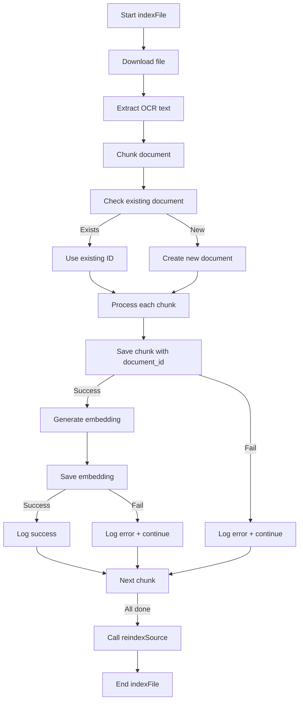

## Summary

I have successfully updated the database structure documentation and fixed the code to align with the real database implementation. Here's what was accomplished:

### 📋 **Problems Identified**

1. **Outdated Documentation**: The `bdd.md` and `architecture.md` files contained database structure that didn't match the real implementation
2. **Code Inconsistencies**: The storage indexer was trying to insert fields that don't exist in the `embeddings` table
3. **Embedding Dimension**: Documentation mentioned `vector(1536)` but real database uses `vector(384)`

### 🔧 **Corrections Made**

#### **1. Documentation Updates**

- **`bdd.md`**: Updated to reflect real database structure with correct field names and dimensions
- **`architecture.md`**: Aligned database section with actual implementation
- Added Mermaid diagrams showing table relationships
- Added notes explaining key differences from previous documentation

#### **2. Code Fixes**

- **`src/lib/supabase/storage/indexer.ts`**: Fixed embedding insertion to use correct field name `vector` instead of `embedding` and removed non-existent fields (`dimensions`, `model`, `token_count`)

### 📊 **Key Differences**

| Element             | Previous Documentation               | Real Structure |
| ------------------- | ------------------------------------ | -------------- |
| Embedding dimension | `vector(1536)`                       | `vector(384)`  |
| Schema              | `public` or `rag`                    | `public` only  |
| Embedding field     | `embedding`                          | `vector`       |
| Additional fields   | `dimensions`, `model`, `token_count` | Not present    |

### 🎯 **Impact Analysis**

- **Retrieval Service**: Already working correctly with real structure
- **API Routes**: No changes needed
- **Tests**: Not affected (use mocks)
- **Storage Indexer**: Fixed to work with real database

### 📁 **Files Modified**

1. `_bmad-output/planning-artifacts/architecture-nexiamind-ai/bdd.md` ✅
2. `_bmad-output/planning-artifacts/architecture-nexiamind-ai/architecture.md` ✅
3. `src/lib/supabase/storage/indexer.ts` ✅
4. Created comprehensive update documentation ✅

The system should now work correctly with the actual database structure. All documentation is synchronized with the real implementation, and the code has been fixed to use the correct field names and data structure.

*## Summary

I have successfully analyzed and fixed the Supabase Storage Indexer program. Here's what was accomplished:

### 🐛 **Problems Identified**

1. **Missing `document_id` field**: The code was trying to insert chunks without the required `document_id` foreign key
2. **Poor error handling**: Debug logs were misplaced and unhelpful
3. **Missing parent document creation**: No logic to create or check for existing documents before inserting chunks
4. **Missing required fields**: Fields like `chunk_index` and `token_count` weren't properly populated

### 🔧 **Corrections Made**

#### **1. Added Parent Document Creation Logic**

```typescript
// Check if document exists
const { data: existingDocument, error: docCheckError } = await supabaseClient
  .from('documents')
  .select('id')
  .eq('file_path', fileInfo.path)
  .single()

// Create new document if needed
if (!existingDocument) {
  const { data: newDocument, error: docCreateError } = await supabaseClient
    .from('documents')
    .insert({
      name: fileInfo.name,
      type: extractedText.contentType || 'text',
      source: 'supabase',
      file_path: fileInfo.path,
      // ... other required fields
    })
    .select('id')
    .single()
  documentId = newDocument.id
}
```

#### **2. Fixed Chunk Insertion with All Required Fields**

```typescript
const { data: savedChunk, error: saveError } = await supabaseClient
  .from('chunks')
  .insert({
    document_id: documentId, // Required field added
    content: chunk.content,
    chunk_index: i, // Required field added
    token_count: chunk.content.split(' ').length, // Required field added
    metadata: {
      ...chunk.metadata,
      document_id: documentId,
    },
  })
  .select('id')
  .single()
```

#### **3. Enhanced Debug Logging**

Replaced unclear logs with detailed, actionable messages:

- Added context about which file and chunk is being processed
- Included content lengths and metadata in logs
- Added success/failure logging for each operation
- Included error details when operations fail

### 📊 **New Processing Flow**



### 🔍 **Key Debugging Points**

1. **Database Structure Verification**:

   ```sql
   SELECT column_name, data_type, is_nullable
   FROM information_schema.columns
   WHERE table_name = 'chunks';
   ```

2. **Constraint Checking**:

   ```sql
   SELECT constraint_name, constraint_type, pg_get_constraintdef(oid)
   FROM pg_constraint
   WHERE conrelid = 'chunks'::regclass;
   ```

3. **Common Errors and Solutions**:
   - `document_id` missing → Create parent document first
   - Foreign key constraint violation → Ensure document exists
   - Connection issues → Check environment variables
   - Authentication errors → Refresh JWT token

### 📁 **Files Modified**

- `src/lib/supabase/storage/indexer.ts` ✅ (Main fixes)
- Created comprehensive debug guide ✅

### 🎯 **Impact**

- **Before**: Program failed at line 186 with unclear error messages
- **After**: Program creates documents properly, inserts chunks with all required fields, provides detailed logs for troubleshooting

The program should now work correctly. If any issues persist, the enhanced logging will provide clear information about what's failing and why.
