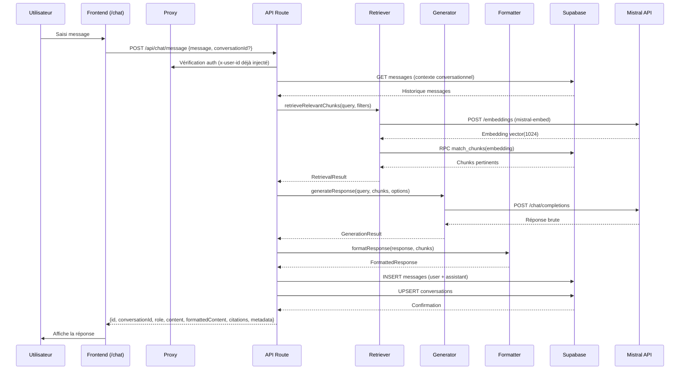

Voici un **résumé complet du fonctionnement du module de chat** avec le cheminement exact de la demande dans le pipeline RAG, vers Mistral, et le retour de la réponse.

---

---

## **🔄 Flux Global : De l'UI à la Réponse Finalisée**

```
Frontend (Page /chat)
    ↓ [POST /api/chat/message]
Proxy (src/proxy.ts) → Authentification + Injection x-user-id
    ↓
API Route (message/route.ts)
    ↓
Récupération du contexte conversationnel (Supabase)
    ↓
🔴 PIPELINE RAG :
    │
    ├─ 1️⃣ RETRIEVER (retriever.ts)
    │   ├─ Génération embedding requête → Mistral Embeddings API (mistral-embed, 1024D)
    │   └─ Recherche vectorielle → Supabase RPC match_chunks() [pgvector]
    │       → Retourne ~5 chunks pertinents triés par similarité cosinus
    │
    ├─ 2️⃣ GENERATOR (generator.ts)
    │   ├─ Construction du contexte à partir des chunks (format "--- Source: X ---")
    │   ├─ Génération du prompt → buildPrompt() (src/lib/rag/prompts.ts)
    │   └─ Appel Mistral Chat API → POST /chat/completions
    │       (modèle: mistral-small par défaut, température: 0.7, max_tokens: 2048)
    │
    └─ 3️⃣ FORMATTER (formatter.ts)
        ├─ Extraction des citations automatiques depuis la réponse brute
        ├─ Remplacement par placeholders [1], [2], etc.
        ├─ Nettoyage des artifacts
        └─ Ajout section "Sources" en bas de la réponse
           
    ↓
Stockage dans Supabase :
    ├─ Message utilisateur → table messages (role: user)
    ├─ Message assistant → table messages (role: assistant, avec citations & métadonnées)
    └─ Mise à jour conversation → table conversations (upsert: titre, updated_at)
    ↓
Réponse JSON au frontend
    ↓
Affichage dans ChatMessageList (avec espace réservé pour les sources)
```

---

---

## **📋 Détail par Étape**

---

### **1️⃣ Frontend : Interface Utilisateur**

**Composants clés** (`src/components/Chat/`) :
- **`page.tsx`** : Gère l'état local (`messages`, `conversationId`, `isSending`, `error`)
- **`ChatInput.tsx`** : Textarea auto-grandissante + bouton d'envoi (désactivé si vide ou en chargement)
- **`ChatMessageList.tsx`** : Liste des messages avec scroll automatique (`role="log"`, `aria-live="polite"`)
- **`ChatMessage.tsx`** : Bulles différenciées (user: fond corail à droite, assistant: fond neutre à gauche + avatar)
- **`TypingIndicator.tsx`** : Animation 3 points pendant l'attente
- **`HistoryMenu.tsx`** : Menu overlay des conversations (pattern similaire à `UserMenu`)
- **`api.ts`** : Client fetch frontend avec 2 fonctions :
  - `sendMessage(message, conversationId?)` → `POST /api/chat/message`
  - `getHistory(limit, offset)` → `GET /api/chat/history`

**Comportement** :
- Optimistic UI : le message utilisateur s'affiche immédiatement
- L'indicateur de chargement remplace la future bulle assistant pendant l'attente (NF-001 : < 3s)
- L'historique se charge au montage de la page (mais **ne contient pas le contenu des messages**, seulement les métadonnées)

---

### **2️⃣ Proxy : Authentification et Sécurité**

**Fichier** : `src/proxy.ts`

**Fonctionnement** :
1. Vérifie la session Supabase via `supabase.auth.getUser()` (revalidation côté serveur)
2. **Pour toute route `/api/chat/*`** (dans `PROTECTED_API_PREFIXES`) :
   - Si utilisateur non authentifié → retourne `401 Unauthorized`
   - Sinon → injecte dans les headers :
     - `x-user-id` : ID de l'utilisateur vérifié
     - `x-user-email` : Email de l'utilisateur
3. **Pour les pages non publiques** (hors `PUBLIC_PAGE_ROUTES`) :
   - Redirige vers `/auth/login?redirect=<chemin>` si non authentifié

⚠️ **Point clé** : Aucune vérification d'authentification n'est nécessaire dans les composants frontend ou les pages `/chat` — tout est géré transparently par le proxy.

---

### **3️⃣ API Route : Traitement de la Requête**

**Fichier** : `src/app/api/chat/message/route.ts`

**Étapes** :

1. **Authentification** (lines 63-78) :
   - Lit `x-user-id` et `x-user-email` des headers (injectés par le proxy)
   - Si absent → `401 Non autorisé`

2. **Validation** (lines 80-116) :
   - Parse le body JSON
   - Vérifie que `message` existe, est une string, et n'est pas vide

3. **Récupération du contexte conversationnel** (lines 123-152) :
   - Si `conversationId` fourni :
     ```sql
     SELECT content, role FROM messages
     WHERE conversation_id = ? AND user_id = ?
     ORDER BY created_at ASC
     ```
   - Formate le contexte : `"user: message1\nassistant: response1\n..."`

4. **🔴 Appel Retrieve Relevant Chunks** (lines 154-179) :
   ```typescript
   retrievalResult = await retrieveRelevantChunks(body.message, {
     client: 'nexia',
     userId,
     limit: 5
   })
   ```
   - **Entrée** : requête utilisateur + filtres (client, userId, limit)
   - **Sortie** : `RetrievalResult` avec `chunks[]` (5 chunks max), `averageSimilarity`, `searchTime`

5. **🔴 Appel Generate Response** (lines 181-208) :
   ```typescript
   generationResult = await generateResponse(body.message, retrievalResult.chunks, {
     userRole: 'user',
     conversationContext: conversationContext || undefined,
     model: body.options?.model || 'default',
     temperature: body.options?.temperature,
     maxTokens: body.options?.maxTokens
   })
   ```
   - **Entrée** : requête + chunks de contexte + options
   - **Sortie** : `GenerationResult` avec `response` (texte brut), `tokensUsed`, `generationTime`

6. **🔴 Appel Format Response** (lines 210-231) :
   ```typescript
   formatted = await formatResponse(generationResult.response, retrievalResult.chunks)
   ```
   - **Entrée** : réponse brute du LLM + chunks utilisés
   - **Sortie** : `FormattedResponse` avec `formattedContent` (avec citations), `citations[]`, `citationCount`

7. **Stockage dans Supabase** (lines 233-337) :
   - Création d'un `conversationId` si absent (`conv_${Date.now()}_${userId}`)
   - Insertion du message utilisateur dans `messages`
   - Insertion du message assistant dans `messages` avec :
     - `content`: réponse formatée
     - `metadata`: `{ model, citations, processingTime, tokensUsed, source: 'rag-pipeline' }`
   - Upsert dans `conversations` (création ou mise à jour du titre et `updated_at`)

8. **Retour de la réponse** (lines 342-356) :
   ```json
   {
     "id": "msg_..._assistant_...",
     "conversationId": "conv_...",
     "role": "assistant",
     "content": "réponse brute du LLM",
     "formattedContent": "réponse avec citations formatées",
     "citations": [
       {"index": 1, "sourcePath": "document.pdf", "documentType": "...", ...}
     ],
     "metadata": {
       "model": "mistral-small",
       "tokensUsed": 123,
       "processingTime": 1500,
       "timestamp": "2026-07-06T..."
     }
   }
   ```

---

### **4️⃣ Pipeline RAG : Cœur du Système**

---

#### **🎯 Retriever (retriever.ts)**

**Rôle** : Trouver les informations pertinentes dans la base de connaissances.

**Processus** :
1. **Génération de l'embedding** (lines 134-144) :
   ```typescript
   queryEmbeddingResult = await this.embeddingService.generateEmbedding(query)
   ```
   - Appelle **Mistral Embeddings API** (`mistral-embed` model)
   - Retourne un vecteur de **1024 dimensions**

2. **Recherche vectorielle** (lines 208-211) :
   ```typescript
   const { data, error } = await this.supabase.rpc('match_chunks', {
     query_embedding: queryEmbedding,
     match_count: 1024
   })
   ```
   - Utilise une **fonction RPC PostgreSQL** (`match_chunks`) qui :
     - Effectue une recherche de similarité cosinus (`1 - (vector <=> query_embedding)`)
     - Joint les tables `embeddings` → `chunks` → `documents`
     - Trie par similarité (descendant)
     - Limite à `match_count` (1024 dans le code, mais filtré à 5 ensuite)

3. **Filtrage et tri** (lines 237-254) :
   - Filtre par `similarityThreshold` si défini
   - Trie les résultats par similarité (meilleure similarité en premier)
   - Retourne **5 chunks maximum** (défini par `filters.limit || 5`)

**Base de données** :
- **Table `embeddings`** : Stocke les vecteurs (`vector vector(1024)`) associés aux chunks
- **Table `chunks`** : Contient le contenu textuel et les métadonnées
- **Table `documents`** : Métadonnées des documents (nom, type, client, language, etc.)

---

#### **🤖 Generator (generator.ts)**

**Rôle** : Générer une réponse contextuelle en utilisant Mistral Chat.

**Processus** :
1. **Construction du contexte** (lines 175, 321-340) :
   ```typescript
   const context = chunks.map((chunk, index) => {
     const source = chunk.metadata.documentPath || chunk.metadata.source || `Source ${index + 1}`;
     return `--- Source: ${source} ---\n${chunk.content}`;
   }).join('\n\n');
   ```
   - Formate chaque chunk avec son nom de source
   - Séparation par double saut de ligne

2. **Construction du prompt** (lines 177-185) :
   ```typescript
   const messages = buildPrompt(
     query,
     context,
     userRole || 'user',
     { conversationId: options.conversationId || '' }
   )
   ```
   - Utilise `src/lib/rag/prompts.ts` pour créer un prompt structuré
   - Inclut le contexte dans le message system ou user (selon la stratégie)

3. **Appel à Mistral Chat API** (lines 188-192, 360-362) :
   ```typescript
   const response = await this.client.post('/chat/completions', {
     model: this.config.model,        // "mistral-small" par défaut
     messages: messages,              // Array de {role, content}
     temperature: options.temperature || this.config.temperature,  // 0.7 par défaut
     max_tokens: options.maxTokens || this.config.maxTokens,        // 2048 par défaut
     top_p: this.config.topP           // 0.9 par défaut
   });
   ```
   - **Endpoint** : `https://api.mistral.ai/v1/chat/completions`
   - **Headers** : `Authorization: Bearer ${MISTRAL_API_KEY}`
   - **Timeout** : 60 secondes par défaut

4. **Retour du résultat** :
   - `response.choices[0].message.content` → Réponse texte brute
   - `response.usage?.total_tokens` → Nombre de tokens utilisés

**Configuration** (lines 95-110) :
```typescript
this.config = {
  apiKey: process.env.MISTRAL_API_KEY,                    // ✅ Obligatoire
  baseUrl: 'https://api.mistral.ai/v1',                  // URL de base
  model: 'mistral-small',                                // Modèle par défaut
  timeout: 60000,                                        // 60s
  maxRetries: 3,                                        // 3 tentatives
  temperature: 0.7,                                    // Créativité
  maxTokens: 2048,                                     // Longueur max
  topP: 0.9                                            // Diversité
}
```

---

#### **📜 Formatter (formatter.ts)**

**Rôle** : Formater la réponse avec des citations et une section Sources.

**Processus** :
1. **Extraction des citations** (lines 137-173) :
   - Détection des patterns dans la réponse brute :
     - `--- Source: document.pdf ---`
     - `[Source: document.pdf]`
   - Pour chaque citation trouvée :
     - Recherche du chunk correspondant dans les chunks utilisés
     - Extrait les métadonnées (sourcePath, documentType, client, language, source)
     - Remplace par un placeholder `[1]`, `[2]`, etc.

2. **Nettoyage** (lines 109-110, 255-262) :
   - Suppression des multiples espaces
   - Réduction des lignes vides multiples

3. **Ajout de la section Sources** (lines 235-248) :
   ```markdown
   ---
   **Sources :**
   [1]: nom-du-document.pdf - Type: PDF, Client: Nexia, Language: FR
   [2]: autre-document.md
   ```

4. **Retour du résultat formaté** :
   - `formattedContent` : Réponse avec citations remplacées et section Sources
   - `citations` : Array de `Citation` objets avec métadonnées
   - `citationCount` : Nombre total de citations

---

### **5️⃣ Stockage et Persistance**

**Base de données Supabase** :

| Table | Rôle | Champs clés |
|-------|------|-------------|
| `conversations` | Liste des conversations | `id`, `user_id`, `title`, `created_at`, `updated_at` |
| `messages` | Historique des messages | `id`, `conversation_id`, `user_id`, `role` (user/assistant), `content`, `metadata` |
| `documents` | Documents indexés | `id`, `name`, `file_path`, `type`, `client_id`, `language`, `source` |
| `chunks` | Morceaux de documents | `id`, `document_id`, `content`, `chunk_index`, `token_count`, `metadata` |
| `embeddings` | Vecteurs des chunks | `id`, `chunk_id`, `vector vector(1024)`, `created_at` |

**Métadonnées stockées** (dans `messages.metadata` pour les réponses assistant) :
```json
{
  "model": "mistral-small",
  "citations": [...],
  "processingTime": 1500,
  "tokensUsed": 123,
  "source": "rag-pipeline"
}
```

---

### **6️⃣ Historique des Conversations**

**Fichier** : `src/app/api/chat/history/route.ts`

**Fonctionnement** :
1. Vérification de l'authentification (via `x-user-id`)
2. Récupération des conversations de l'utilisateur :
   ```sql
   SELECT id, title, created_at, updated_at FROM conversations
   WHERE user_id = ?
   ORDER BY updated_at DESC
   LIMIT ? OFFSET ?
   ```
3. Comptage des messages par conversation :
   ```sql
   SELECT conversation_id FROM messages
   WHERE conversation_id IN (...) AND user_id = ?
   ```
   - Compte manuellement en JS (pas de `.group()` utilisé)
4. Retourne :
   ```json
   {
     "conversations": [
       {
         "id": "conv_...",
         "title": "Ma conversation",
         "createdAt": "...",
         "updatedAt": "...",
         "messageCount": 5
       }
     ],
     "total": 10,
     "offset": 0,
     "limit": 50
   }
   ```

⚠️ **Limitation actuelle** :
- **L'historique ne contient PAS le contenu des messages** — seulement les métadonnées
- Sélectionner une conversation existante dans le menu historique **ne recharge pas les anciens messages**
- Seuls les nouveaux messages s'attachent à cette conversation
- Pour un vrai rechargement, un endpoint `GET /api/chat/messages?conversationId=` serait nécessaire (hors périmètre ST-303, prévu pour ST-306)

---

---

## **📊 Schéma Ré capitulatif**



---

---

## **🔍 Points Clés à Retenir**

| Aspect | Détails |
|--------|---------|
| **Authentification** | Transparente via `proxy.ts` → injection `x-user-id`/`x-user-email` |
| **RAG Pipeline** | Retriever → Generator → Formatter (séquentiel, pas de streaming) |
| **Mistral Embeddings** | Modèle `mistral-embed`, 1024 dimensions, pour la recherche vectorielle |
| **Mistral Chat** | Modèle `mistral-small` par défaut, endpoint `/chat/completions` |
| **Base de données** | Supabase + pgvector pour la recherche vectorielle |
| **Citations** | Automatiquement extraites et formatées dans la réponse |
| **Stockage** | Tous les messages et conversations persistés dans Supabase |
| **Frontend** | React + TypeScript, composants dédiés dans `src/components/Chat/` |
| **Temps de réponse** | NF-001 : < 3 secondes (objectif) |
| **Accessibilité** | WCAG 2.1 AA : `role="log"`, `aria-live="polite"`, `role="alert"` pour les erreurs |

---
---
## **⚠️ Limitations et Points d'Attention**

1. **Pas de streaming** : La réponse est générée en une seule fois (pas de SSE/streaming token par token)
2. **Historique incomplet** : L'endpoint `GET /api/chat/history` ne retourne que les métadonnées des conversations, pas le contenu des messages
3. **Rechargement des conversations** : Sélectionner une conversation existante dans le menu historique **ne recharge pas les anciens messages** (limitation documentée dans la story)
4. **Citations** : Le formatage des citations et l'affichage des sources sont hors périmètre de ST-303 (couvert par ST-305)
5. **Rendu Markdown** : Le rendu enrichi (titres, listes, code) est hors périmètre (couvert par ST-307)
6. **Multiples conversations** : La bascule complète entre conversations avec URL `[conversationId]` est hors périmètre (couvert par ST-306)

---
---
## **📁 Structure des Fichiers**

```
src/
├── app/
│   ├── chat/
│   │   ├── page.tsx              # Page principale du chat
│   │   └── __tests__/
│   │       └── page.test.tsx
│   └── api/
│       ├── chat/
│       │   ├── message/
│       │   │   ├── route.ts      # POST /api/chat/message (traitement RAG)
│       │   │   └── __tests__/
│       │   └── history/
│       │       ├── route.ts      # GET /api/chat/history (liste conversations)
│       │       └── __tests__/
│
├── components/
│   └── Chat/
│       ├── index.tsx             # Barrel export
│       ├── ChatInput.tsx         # Zone de saisie
│       ├── ChatMessage.tsx       # Bulle de message
│       ├── ChatMessageList.tsx   # Liste des messages
│       ├── TypingIndicator.tsx   # Indicateur de saisie
│       ├── HistoryMenu.tsx       # Menu historique
│       ├── icons.tsx             # Icônes locales
│       ├── types.ts              # Types TypeScript
│       ├── api.ts                # Client fetch frontend
│       └── __tests__/            # Tests des composants
│
└── lib/
    └── rag/
        ├── index.ts              # Exports principaux
        ├── retriever.ts          # Recherche vectorielle
        ├── generator.ts          # Génération via Mistral
        ├── formatter.ts          # Formatage des réponses
        ├── embeddings.ts         # Génération des embeddings
        ├── chunker.ts            # Découpage des documents
        ├── prompts.ts            # Templates de prompts
        ├── types.ts              # Types RAG
        └── utils.ts              # Utilitaires
```

---
---
**Résumé final** : Le module de chat implémente un pipeline RAG complet où la requête utilisateur est **vectorisée** pour trouver des chunks pertinents dans la base de connaissances, puis **envoyée à Mistral** avec ce contexte pour générer une réponse **formatée avec citations**. Tout est sécurisé par authentification Supabase et les données sont persistées pour permettre l'historique des conversations.